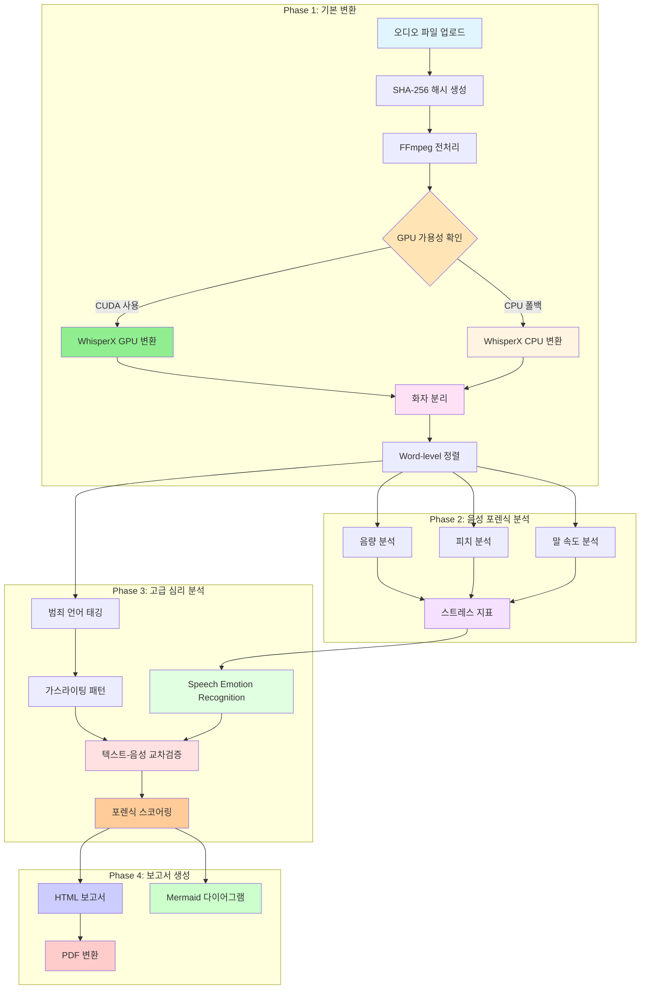
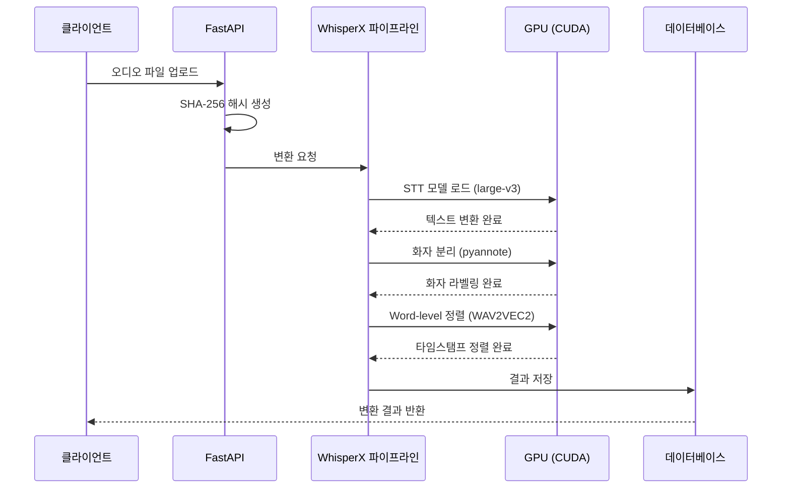
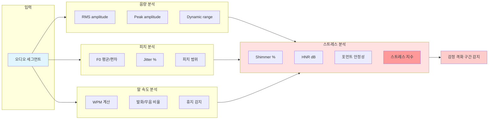
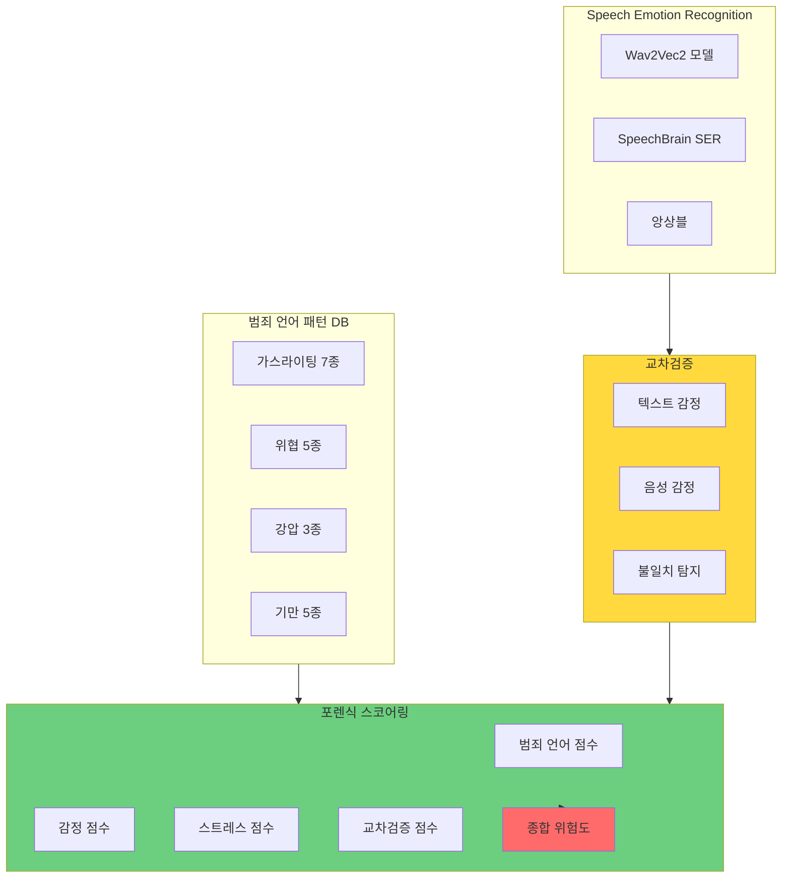
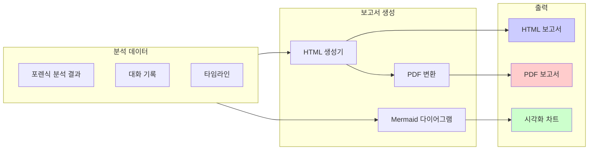
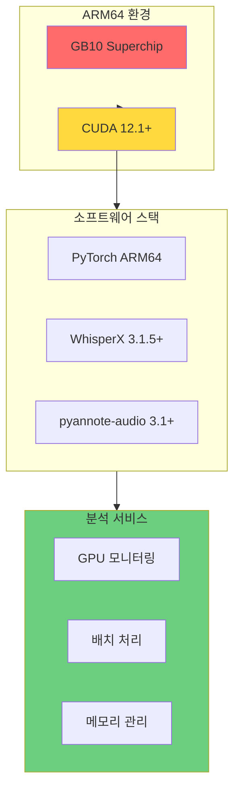
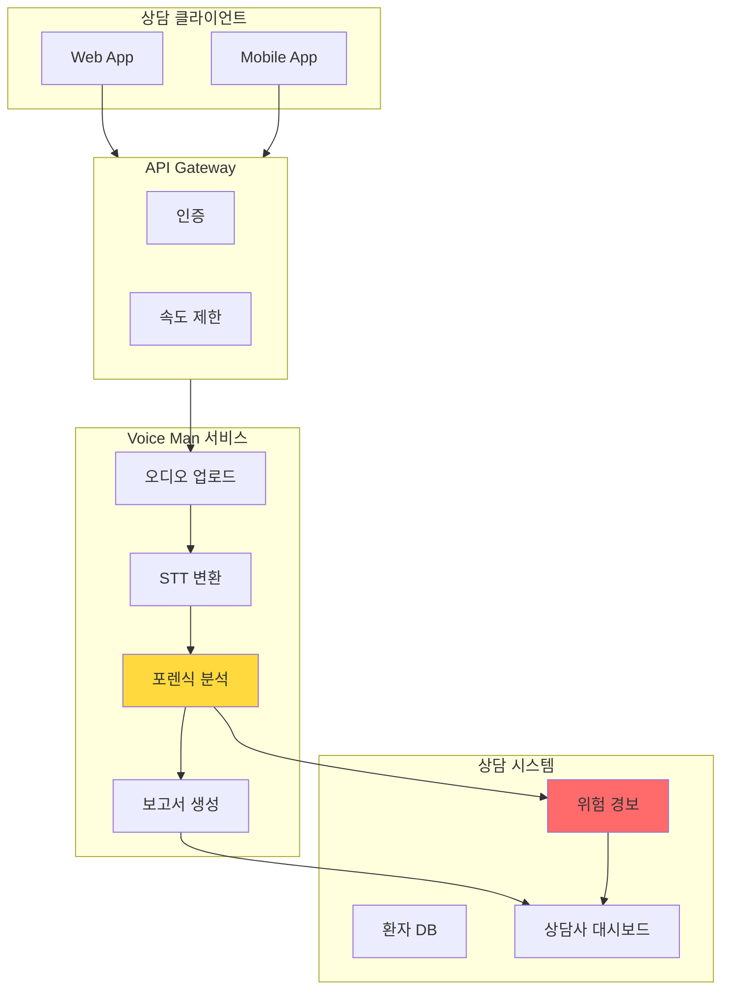
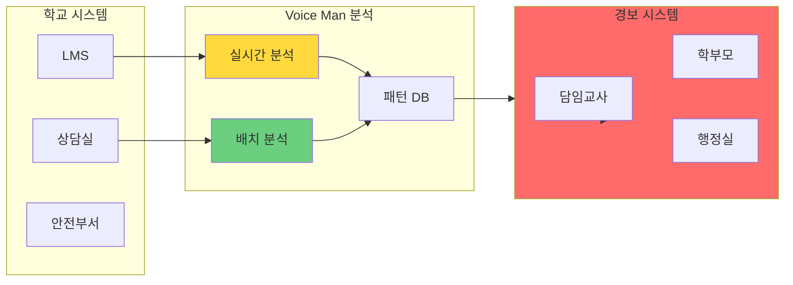

# Voice Man

음성 녹취 증거 분석 시스템

## 개요

Voice Man은 음성 녹취 파일을 텍스트로 변환하고, 법적 증거로 활용 가능한 형태로 분석하는 통합 시스템입니다. 협박, 공갈, 사기, 모욕 등 범죄 발언을 자동으로 태깅하고, 가스라이팅과 같은 심리적 조작 패턴을 감지하여 체계적인 증거 보고서를 생성합니다.

**GPU 가속을 통한 고성능 병렬 처리**로 대량의 오디오 파일을 빠르게 분석할 수 있습니다.

## 핵심 기능

- **오디오 파일 업로드 및 관리**: 다양한 형식의 오디오 파일 지원 (mp3, wav, m4a, flac, ogg)
- **FFmpeg 기반 오디오 전처리**: 오디오 정규화 및 메타데이터 추출
- **faster-whisper 기반 STT**: GPU 가속 음성-텍스트 변환 (WER < 10%)
- **pyannote-audio 화자 분리**: 자동 화자 구분 및 레이블링 (DER < 15%)
- **범죄 발언 자동 태깅**: 협박, 공갈, 사기, 모욕 유형 자동 감지
- **범죄 유형 분류 시스템**: 11개 형법 죄명으로 멀티모달 분류 (98% 테스트 커버리지)
  - 사기, 공갈, 강압, 위협, 모욕, 명예훼손, 업무상위계등, 감금, 체포감금, 특수공무원감금, 살인(준비)
  - Dark Triad 심리 프로파일링 (나르시시즘, 마키아벨리즘, 사이코패시)
  - 95% 신뢰구간 계산 (Bootstrap 방식)
  - 한국 형법 요구사항 매핑
- **심리 분석**: 가스라이팅 패턴 및 감정 분석
- **음성 포렌식 분석**: 음량/피치/말속도 분석, 스트레스 지표 추출, 감정 격화 구간 감지
- **법적 증거 보고서 생성**: PDF 형식의 종합 보고서
- **GPU 병렬 처리**: CUDA 기반 고성능 배치 처리 (50배 성능 향상)
- **WhisperX 통합 파이프라인**: STT + 타임스탬프 정렬 + 화자분리 end-to-end GPU 처리
- **Word-level 타임스탬프**: WAV2VEC2 기반 100ms 이내 정확도
- **오디오 포맷 자동 변환**: m4a/mp3/wav/flac/ogg -> 16kHz mono WAV

## 신규 서비스 모듈

### 포렌식 웹 인터페이스 (SPEC-FORENSIC-WEB-001) - 진행 중

웹 기반 포렌식 증거 프레젠테이션 시스템을 개발 중입니다.

**현재 진행 상황**:
- ULID 유틸리티 모듈 구현 완료
- 백엔드 인증 시스템 개발 중
- Next.js 16 + FastAPI 기반 웹 인터페이스 예정

**계획된 기능**:
- 인터랙티브 고소장 뷰어
- 포렌식 분석 탐색기
- 증거 비교 대시보드
- 보안 및 접근 제어 (JWT + RBAC)

### NLP 서비스 (KoBERT 기반 한국어 텍스트 분석) - 완료

**SPEC-NLP-KOBERT-001** 구현 완료 (2026-01-11)

**KoBERT 모델 래퍼** (`src/voice_man/services/nlp/kobert_model.py`):
- GPU/CPU 자동 감지 및 장치 전환
- 싱글톤 패턴으로 효율적 리소스 관리
- 배치 처리 지원
- GPU 메모리 모니터링
- 한국어 BERT 임베딩 추출

```python
from voice_man.services.nlp.kobert_model import KoBERTModel

# 모델 초기화 (자동 GPU 감지)
model = KoBERTModel(device="auto")

# 텍스트 임베딩 추출
embeddings = model.get_embeddings("한국어 텍스트 분석")

# 배치 처리
results = model.encode_batch(["텍스트 1", "텍스트 2", "텍스트 3"])
```

**감정 분류기** (`src/voice_man/services/nlp/emotion_classifier.py`):
- 7개 감정 카테고리 분류 (행복, 슬픔, 분노, 공포, 혐오, 놀람, 중립)
- 신뢰도 점수 계산
- 불확실성 플래그
- 배치 처리 지원

```python
from voice_man.services.nlp.emotion_classifier import KoBERTEmotionClassifier

classifier = KoBERTEmotionClassifier()
result = classifier.classify("오늘 정말 기뻐요")
print(result.primary_emotion)  # 'happiness'
print(result.confidence)       # 0.85
```

**한국어 문화적 맥락 분석기** (`src/voice_man/services/nlp/cultural_analyzer.py`):
- 존댓말/반말 분석 (합쇼체, 해요체, 해체, 해라체)
- 위계 관계 패턴 탐지 (가족, 직장, 사회적 관계 마커)
- 한국어 특유 조작 표현 패턴 탐지 (가스라이팅, 위협, 강압)

```python
from voice_man.services.nlp.cultural_analyzer import KoreanCulturalAnalyzer

analyzer = KoreanCulturalAnalyzer()

# 존댓말/반말 분석
speech = analyzer.analyze_speech_level("안녕하세요? 오늘 날씨 좋네요.")
print(speech.level)  # 'formal'

# 위계 관계 탐지
hierarchy = analyzer.detect_hierarchy_context("어머니, 오늘 밥 드셨어요?")
print(hierarchy.has_family_markers)  # True

# 조작 패턴 탐지
patterns = analyzer.detect_manipulation_patterns("네가 잘못했으니까 그래")
print(len(patterns))  # 1
print(patterns[0].category)  # 'gaslighting'
```

**구현 현황**:
- 45/45 테스트 통과 (100%)
- 69% 코드 커버리지
- 1,009줄 코드 구현
- 문서화 완료 (NLP_ARCHITECTURE.md, KOBERT_INTEGRATION_GUIDE.md, EMOTION_ANALYSIS_API.md, CULTURAL_CONTEXT_ANALYSIS.md)

### EdgeXpert 통합 (IoT 장치 데이터 연동)

MSI EdgeXpert (NVIDIA Grace Blackwell) 환경 최적화 서비스입니다.

**GPU 최적화 서비스** (`src/voice_man/services/edgexpert/`):
- `UnifiedMemoryManager`: 통합 메모리 관리
- `CUDAStreamProcessor`: CUDA 스트림 병렬 처리
- `HardwareAcceleratedCodec`: 하드웨어 가加速 코덱
- `BlackWellOptimizer`: Blackwell 아키텍처 최적화
- `ARMCPUPipeline`: ARM CPU 네이티브 파이프라인
- `ThermalManager`: 열 관리 및 전력 최적화

## 시스템 아키텍처

### 전체 파이프라인 (4단계 포렌식 분석)

Voice Man은 4단계 포렌식 분석 파이프라인을 통해 음성 녹취 파일을 법적 증거로 활용 가능한 형태로 변환합니다.



### Phase별 상세 아키텍처

#### Phase 1: 기본 변환 (STT + 화자 분리)



#### Phase 2: 음성 포렌식 분석



#### Phase 3: 고급 심리 분석



#### Phase 4: 보고서 생성



### ARM64 GPU 가속 아키텍처



## 기술 스택

### 백엔드
- **Python 3.12**: 핵심 개발 언어 (ARM64 CUDA 호환성)
- **FastAPI 0.115+**: 고성능 비동기 웹 프레임워크
- **SQLAlchemy 2.0+**: 비동기 ORM
- **Pydantic 2.9+**: 데이터 검증 및 직렬화
- **Uvicorn 0.32+**: ASGI 서버

### 오디오 처리 및 STT
- **faster-whisper 1.0.3+**: GPU 가속 STT 엔진 (OpenAI Whisper 대비 4배 빠름)
- **pyannote-audio 3.1+**: 화자 분리
- **WhisperX 3.1.5+**: 통합 STT + Alignment + Diarization 파이프라인
- **WAV2VEC2**: Word-level 타임스탬프 정렬 (한국어 모델 지원)
- **transformers 4.36.0+**: WAV2VEC2 모델 백엔드
- **huggingface-hub 0.20.0+**: 모델 다운로드 및 인증
- **FFmpeg 6.0+**: 오디오 전처리

### 음성 포렌식 분석
- **librosa 0.10.2+**: 음향 특성 추출 (RMS, F0, spectral)
- **parselmouth 0.4.3+**: Praat 기반 음성학 분석 (jitter, shimmer, HNR, formant)

### GPU 가속 오디오 처리
- **torchcrepe 0.0.22+**: GPU 배치 처리 F0 추출 (librosa.pyin 대비 160x 성능 향상)
- **nnAudio 0.3.2+**: GPU 기반 스펙트로그램 생성 (STFT, Mel, CQT)

### GPU 가속 및 병렬 처리
- **PyTorch 2.5+**: GPU 연산 프레임워크
- **CUDA 12.1+**: NVIDIA GPU 가속
- **pynvml**: GPU 메모리 모니터링
- **psutil**: 시스템 리소스 모니터링

### NLP 서비스 (KoBERT)
- **transformers 4.48+**: HuggingFace Transformers (KoBERT 모델 지원)
- **torch 2.0+**: PyTorch (GPU/CPU 자동 지원)
- **KoBERT (skt/kobert-base-v1)**: 한국어 BERT 모델
- **감정 분류**: 7개 감정 카테고리 (행복, 슬픔, 분노, 공포, 혐오, 놀람, 중립)
- **문화적 맥락 분석**: 존댓말/반말, 위계 관계, 조작 패턴 탐지

### 데이터베이스
- **SQLite**: 개발 환경
- **PostgreSQL 16+**: 운영 환경 (Phase 2에서 마이그레이션 예정)

### 테스트 및 품질
- **pytest 9.0+**: 테스트 프레임워크
- **pytest-cov 7.0+**: 커버리지 리포트
- **ruff 0.8+**: 린팅 및 포맷팅

## 시스템 요구사항

### 최소 요구사항
- Python 3.12 (ARM64 CUDA 호환성)
- 최소 16GB RAM
- 최소 100GB SSD 저장 공간

### GPU 가속 요구사항 (권장)
- CUDA 12.1+ 지원 GPU (권장: NVIDIA RTX 3080+ 또는 GB10)
- GPU 메모리: 최소 8GB (권장 16GB+)
- cuDNN 9.0+

### 환경 변수 설정 (GPU 사용 시)
```bash
export CUDA_VISIBLE_DEVICES=0
export PYTORCH_CUDA_ALLOC_CONF=expandable_segments:True

# Hugging Face 인증 (WhisperX 화자 분리용, 필수)
export HF_TOKEN="hf_xxxxxxxxxxxxx"

# WhisperX 설정 (선택)
export WHISPERX_MODEL_SIZE="large-v3"
export WHISPERX_LANGUAGE="ko"
```

## 설치

### 1. 저장소 클론

```bash
git clone https://github.com/yourusername/voice.man.git
cd voice.man
```

### 2. 가상 환경 생성

```bash
python -m venv venv
source venv/bin/activate  # Linux/macOS
# 또는
venv\Scripts\activate  # Windows
```

### 3. 의존성 설치

```bash
pip install -e ".[dev]"
```

### 4. FFmpeg 설치

**macOS**:
```bash
brew install ffmpeg
```

**Ubuntu/Debian**:
```bash
sudo apt update
sudo apt install ffmpeg
```

**Windows**:
FFmpeg 공식 웹사이트에서 다운로드하여 설치하세요.

### 5. 데이터베이스 초기화

```bash
alembic upgrade head
```

## 실행

### 개발 모드

```bash
uvicorn voice_man.main:app --reload --port 8000
```

### 프로덕션 모드

```bash
uvicorn voice_man.main:app --host 0.0.0.0 --port 8000 --workers 4
```

## API 문서

서버 실행 후 다음 URL에서 API 문서를 확인할 수 있습니다:

- **Swagger UI**: `http://localhost:8000/docs`
- **ReDoc**: `http://localhost:8000/redoc`

## 주요 API 엔드포인트

| 엔드포인트 | 메서드 | 설명 |
|------------|--------|------|
| `/health` | GET | 헬스체크 |
| `/api/v1/audio/upload` | POST | 오디오 파일 업로드 |
| `/api/v1/audio/{id}/transcribe` | POST | STT 변환 시작 |
| `/api/v1/audio/{id}/transcript` | GET | 변환 결과 조회 |
| `/api/v1/audio/{id}/speakers` | GET | 화자 분리 결과 조회 |
| `/api/v1/audio/{id}/analysis/crime` | GET | 범죄 발언 태깅 결과 |
| `/api/v1/audio/{id}/analysis/psychology` | GET | 심리 분석 결과 |
| `/api/v1/audio/{id}/report` | POST/GET | 증거 보고서 생성/다운로드 |
| `/api/v1/forensic/analyze/{audio_id}` | POST | 음성 특성 분석 시작 |
| `/api/v1/forensic/features/{audio_id}` | GET | 음성 특성 결과 조회 |
| `/api/v1/forensic/emotion/{audio_id}` | GET | SER 분석 결과 조회 |
| `/api/v1/forensic/report` | POST | 종합 포렌식 리포트 생성 |

## 서비스 적용 분야

Voice Man은 다양한 산업 분야에서 음성 분석이 필요한 경우 활용할 수 있습니다.

### 1. 정신 건강 및 상담 센터

**적용 시나리오:**
- 결혼/이혼 상담: 부부 간 갈등 원인 분석, 가스라이팅 패턴 식별
- 가정 폭력 예방: 위협적 언어 패턴 조기 탐지, 위험도 평가
- 심리 치료 보조: 환자의 감정 변화 추적, 치료 효과 모니터링

**활용 기능:**
- 가스라이팅 7종 패턴 탐지 (현실 부정, 전가, 축소, 혼란 유발, 의심 조장, 고립화, 자존감 공격)
- 음성 스트레스 지수 분석 (Shimmer, HNR, 포먼트 안정성)
- 감정 격화 구간 자동 탐지
- 화자별 심리 프로파일 생성

```python
# 상담 센터 연동 예시
from voice_man.services.forensic.forensic_scoring_service import ForensicScoringService

# 부부 상담 녹음 분석
scoring_service = ForensicScoringService()
result = scoring_service.calculate_forensic_score(
    crime_language_score=0.72,  # 가스라이팅 패턴 빈도
    emotion_score=0.65,          # 부정 감정 비율
    stress_score=0.58,           # 음성 스트레스 지수
    cross_validation_score=0.42  # 텍스트-음성 불일치
)

# 위험도 평가
if result.risk_level in ["매우 높음", "높음"]:
    # 전문가 상담 연결 또는 안전 조치 권장
    print(f"위험도: {result.risk_level}, 권장사항: {result.recommendations}")
```

### 2. 교육 기관 및 학교

**적용 시나리오:**
- 가스라이팅/괴롭힘 탐지: 학교 폭력, 교사-학생 간 괴롭힘 패턴 식별
- 학교 폭력 예방: 위협적 발언 조기 경보 시스템
- 교육 상황 모니터링: 교실 내 커뮤니케이션 품질 분석

**활용 기능:**
- 위협 5종 패턴 탐지 (신체/생명/법적/경제적/관계 단절 위협)
- 강압 3종 패턴 탐지 (명령형 발화, 선택지 제한, 긴급성 강조)
- 음량/피치 급격한 변화 감지 (감정 격화 구간)
- 장기적 패턴 추적 (시계열 분석)

```python
# 학교 안전 시스템 연동 예시
from voice_man.services.forensic.crime_language_service import CrimeLanguageService

crime_service = CrimeLanguageService()

# 학생 간 대화 또는 교사-학생 대화 분석
threat_patterns = crime_service.detect_threats(
    "너 오늘 집에 가면 큰일 날 줄 알아?",
    speaker_id="SPEAKER_01"
)

if threat_patterns["high_risk"]:
    # 학교 안전 부서 알림
    alert_level = "CRITICAL" if threat_patterns["immediate_threat"] else "WARNING"
    print(f"[{alert_level}] 위협 패턴 탐지: {threat_patterns['patterns']}")
```

### 3. 기업 교육 및 코칭

**적용 시나리오:**
- 커뮤니케이션 코칭: 직원 간 대화 분석, 개선점 도출
- 리더십 개발: 관리자의 커뮤니케이션 스타일 진단
- 갈등 중재: 부서 간 또는 팀 내 갈등 원인 분석

**활용 기능:**
- 화자별 발화 비율 분석 (지배적 발화 패턴)
- 말 속도 및 휴지 패턴 분석 (말더듬, 망설임)
- 음성-텍스트 감정 일관성 검증 (진정성 평가)
- 대화 타임라인 시각화

```python
# 기업 코칭 플랫폼 연동 예시
from voice_man.services.forensic.audio_feature_service import AudioFeatureService

feature_service = AudioFeatureService()

# 팀 미팅 녹음 분석
analysis = feature_service.analyze_conversation_dynamics(
    audio_segments=segments,
    speakers=["SPEAKER_00", "SPEAKER_01"]
)

# 발화 밸런스 리포트
speaker_00_ratio = analysis["speaker_ratios"]["SPEAKER_00"]
speaker_01_ratio = analysis["speaker_ratios"]["SPEAKER_01"]

print(f"발화 비율 - SPEAKER_00: {speaker_00_ratio:.1%}, SPEAKER_01: {speaker_01_ratio:.1%}")

# 지배적 발화 패턴 경고
if abs(speaker_00_ratio - speaker_01_ratio) > 0.7:
    print("WARNING: 대화 균형이 심각하게 치우쳐 있습니다.")
```

### 4. 법률 및 수사 기관

**적용 시나리오:**
- 수사기관 지원: 협박, 공갈, 사기 녹취 분석
- 법적 증거 분석: 법정 제출용 포렌식 보고서 생성
- 진술 신빙성 평가: 텍스트-음성 불일치 탐지

**활용 기능:**
- 범죄 언어 20종 패턴 데이터베이스 (가스라이팅, 위협, 강압, 기만)
- Speech Emotion Recognition (SER) 다모델 앙상블
- 텍스트-음성 교차검증 (감정 불일치, 위장 감정 탐지)
- 법적 증거 보고서 생성 (HTML/PDF, Mermaid 다이어그램)

```python
# 수사기관 연동 예시
from voice_man.reports.html_generator import ForensicHTMLGenerator
from voice_man.services.forensic.cross_validation_service import CrossValidationService

# 포렌식 분석 실행
cv_service = CrossValidationService()
inconsistencies = cv_service.detect_inconsistencies(
    text_emotion="neutral",
    audio_emotion="anger",
    confidence_diff=0.6
)

# 법정 제출용 보고서 생성
generator = ForensicHTMLGenerator()
html_report = generator.generate_from_json(
    json_path="forensic_analysis.json",
    output_path="evidence_report.html"
)

# 진술 신빙성 평가
if inconsistencies["deception_indicators"] > 0.7:
    print("고위험: 진술 신빙성 저하 지표 다수 탐지")
    print(f"- 음성-텍스트 불일치: {inconsistencies['emotion_mismatch']}")
    print(f"- 위장 감정 가능성: {inconsistencies['disguised_emotion']}")
```

### 산업별 적용 매트릭스

| 산업 분야 | 주요 탐지 패턴 | 활용 분석 | 출력물 |
|-----------|----------------|-----------|--------|
| **정신 건강** | 가스라이팅, 위협 | 음성 스트레스, 감정 추이 | 심리 프로파일, 위험도 평가 |
| **교육** | 위협, 강압, 괴롭힘 | 감정 격화 구간, 발화 밸런스 | 안전 경보, 개입 권고 |
| **기업** | 강압, 기만 | 커뮤니케이션 스타일, 진정성 | 코칭 리포트, 개선안 |
| **법률/수사** | 전체 패턴 | 포렌식 종합 분석, 교차검증 | 법적 증거 보고서 |

## 통합 아키텍처 예시

### 예시 1: 정신 건강 상담 플랫폼 통합



**API 통합 코드 예시:**

```python
# 상담 플랫폼 백엔드 통합
from fastapi import FastAPI, BackgroundTasks
from voice_man.services.whisperx_service import WhisperXService
from voice_man.services.forensic.forensic_scoring_service import ForensicScoringService

app = FastAPI()
whisperx = WhisperXService()
scoring = ForensicScoringService()

@app.post("/api/counseling/session/{session_id}/analyze")
async def analyze_counseling_session(
    session_id: str,
    audio_file: UploadFile,
    background_tasks: BackgroundTasks
):
    # 1. 오디오 파일 저장
    file_path = save_audio_file(audio_file, session_id)

    # 2. 비동기 분석 요청
    background_tasks.add_task(
        run_forensic_analysis,
        session_id=session_id,
        audio_path=file_path
    )

    return {"status": "analyzing", "session_id": session_id}

async def run_forensic_analysis(session_id: str, audio_path: str):
    # STT 변환
    transcription = await whisperx.transcribe(audio_path)

    # 포렌식 분석
    result = scoring.calculate_comprehensive_score(
        transcription=transcription,
        analysis_type="counseling"
    )

    # 위험 경보 발송
    if result.risk_level in ["매우 높음", "높음"]:
        send_alert_to_counselor(
            session_id=session_id,
            risk_level=result.risk_level,
            recommendations=result.recommendations
        )

    # 결과 저장
    save_analysis_result(session_id, result)
```

### 예시 2: 학교 안전 모니터링 시스템



### 예시 3: 기업 커뮤니케이션 트레이닝

```python
# 기업 코칭 플랫폼 연동
from voice_man.services.forensic.audio_feature_service import AudioFeatureService
from voice_man.services.forensic.ser_service import SERService

class CorporateCoachingService:
    """기업 커뮤니케이션 코칭 서비스"""

    def __init__(self):
        self.audio_service = AudioFeatureService()
        self.ser_service = SERService()

    async def analyze_meeting_recording(
        self,
        audio_path: str,
        participants: list[str]
    ) -> dict:
        """회의 녹음 분석"""

        # 1. 음성 특성 분석
        audio_features = self.audio_service.analyze_conversation_dynamics(
            audio_path, participants
        )

        # 2. 감정 분석
        emotion_results = await self.ser_service.batch_analyze(
            audio_path, participants
        )

        # 3. 코칭 인사이트 생성
        insights = self._generate_coaching_insights(
            audio_features, emotion_results
        )

        return {
            "conversation_balance": audio_features["speaker_ratios"],
            "emotion_timeline": emotion_results["timeline"],
            "improvement_areas": insights["areas"],
            "recommendations": insights["recommendations"]
        }

    def _generate_coaching_insights(self, audio, emotion) -> dict:
        """코칭 인사이트 생성"""
        areas = []
        recommendations = []

        # 발화 밸런스 분석
        ratios = audio["speaker_ratios"]
        max_ratio = max(ratios.values())
        if max_ratio > 0.7:
            dominant = max(ratios, key=ratios.get)
            areas.append(f"{dominant}의 지배적 발화 (비율: {max_ratio:.1%})")
            recommendations.append("균형 있는 대화를 위한 발문 기회 분배 권장")

        # 감정 분석
        negative_ratio = emotion["negative_emotion_ratio"]
        if negative_ratio > 0.4:
            areas.append(f"부정 감정 비율 높음 ({negative_ratio:.1%})")
            recommendations.append("감정 조절 훈련 및 비폭력 커뮤니케이션 교육")

        return {"areas": areas, "recommendations": recommendations}
```

## 대화 훈련 서비스 확장

Voice Man의 분석 결과는 대화 훈련 및 커뮤니케이션 스킬 개선에 활용할 수 있습니다.

### 피드백 루프 구조

```mermaid
flowchart LR
    subgraph Analysis[분석 단계]
        Record[녹음 수집]
        Analyze[포렌식 분석]
        Score[스코어링]
    end

    subgraph Feedback[피드백 단계]
        Report[상세 리포트]
        Highlight[개선점 하이라이트]
        Benchmark[벤치마크 비교]
    end

    subgraph Training[훈련 단계]
        Practice[목표 설정 연습]
        Roleplay[롤플레이 시뮬레이션]
        Progress[진척도 추적]
    end

    subgraph Improvement[개선 단계]
        Retest[재분석]
        Compare[전후 비교]
        Validate[개선 효과 검증]
    end

    Record --> Analyze
    Analyze --> Score
    Score --> Report
    Report --> Highlight
    Highlight --> Benchmark
    Benchmark --> Practice
    Practice --> Roleplay
    Roleplay --> Progress
    Progress --> Retest
    Retest --> Compare
    Compare --> Validate
    Validate --> Practice

    style Score fill:#ffd93d
    style Practice fill:#6bcf7f
    style Validate fill:#ff6b6b
```



### 훈련 서비스 API 예시

```python
from voice_man.services.training.coaching_service import CoachingService

class ConversationTrainingService:
    """대화 훈련 서비스"""

    def __init__(self):
        self.coaching = CoachingService()

    async def create_training_plan(
        self,
        user_id: str,
        baseline_recording: str
    ) -> dict:
        """개인별 훈련 계획 생성"""

        # 1. 기준선 분석
        baseline = await self.coaching.analyze_recording(baseline_recording)

        # 2. 약점 식별
        weaknesses = self._identify_weaknesses(baseline)

        # 3. 훈련 목표 설정
        goals = self._set_training_goals(weaknesses)

        # 4. 훈련 프로그램 생성
        program = self._generate_program(goals)

        return {
            "user_id": user_id,
            "baseline_score": baseline["overall_score"],
            "weaknesses": weaknesses,
            "training_goals": goals,
            "program": program
        }

    async def evaluate_practice_session(
        self,
        user_id: str,
        practice_recording: str,
        training_goal: str
    ) -> dict:
        """연습 세션 평가"""

        # 1. 연습 녹음 분석
        practice_result = await self.coaching.analyze_recording(practice_recording)

        # 2. 기준선과 비교
        comparison = await self._compare_with_baseline(user_id, practice_result)

        # 3. 훈련 목표 달성도 평가
        goal_achievement = self._evaluate_goal_achievement(
            training_goal, practice_result
        )

        # 4. 다음 단계 권장
        next_steps = self._recommend_next_steps(goal_achievement)

        return {
            "practice_score": practice_result["overall_score"],
            "improvement": comparison["improvement"],
            "goal_achievement": goal_achievement,
            "next_steps": next_steps
        }
```

### 훈련 시나리오별 가이드

| 훈련 목표 | 분석 지표 | 개선 활동 | 성공 기준 |
|-----------|-----------|-----------|-----------|
| **비폭력 대화** | 위협/강압 패턴, 음량 급증 | "나" 전달법 연습, 휴지 활용 | 위협 패턴 0회, 음량 안정 |
| **경청 능력** | 발화 비율, 인터럽트 횟수 | 3초 대기법, 요약 질문 | 발화 비율 40-60% |
| **감정 표현** | 텍스트-음성 감정 일치, 감정 어휘 | 감정 어휘 확장, 진정성 발화 | 일관성 0.8 이상 |
| **스트레스 관리** | 스트레스 지수, 말 속도 | 호흡 운동, 발화 속도 조절 | 스트레스 지수 40 미만 |

## 테스트

### 모든 테스트 실행

```bash
pytest
```

### 커버리지 리포트 생성

```bash
pytest --cov=voice_man --cov-report=html
```

### 특정 테스트 실행

```bash
pytest tests/unit/test_services.py
```

### E2E 배치 테스트

```bash
# 기본 실행 (배치 크기 15)
uv run python scripts/e2e_batch_test.py --input-dir ref/call

# 배치 크기 및 화자 수 지정
uv run python scripts/e2e_batch_test.py --input-dir ref/call --batch-size 20 --num-speakers 2

# 드라이런 (파일 목록만 확인)
uv run python scripts/e2e_batch_test.py --input-dir ref/call --dry-run
```

## 프로젝트 구조

```
voice.man/
├── src/
│   └── voice_man/
│       ├── __init__.py
│       ├── main.py                 # FastAPI 메인 애플리케이션
│       ├── schemas.py              # Pydantic 스키마
│       ├── models/
│       │   ├── database.py         # SQLAlchemy 모델
│       │   ├── diarization.py      # 화자 분리 모델
│       │   ├── whisper_model.py    # faster-whisper 래퍼 (GPU/CPU 자동 선택)
│       │   ├── whisperx_pipeline.py    # WhisperX 통합 파이프라인
│       │   ├── nlp/                    # NLP 데이터 모델
│       │   │   ├── emotion.py           # 감정 분류 모델
│       │   │   └── cultural.py          # 문화적 맥락 모델
│       │   └── forensic/
│       │       ├── audio_features.py   # 포렌식 오디오 특성 모델
│       │       ├── crime_language.py   # 범죄 언어 패턴 모델
│       │       ├── emotion_recognition.py  # SER 감정 인식 모델
│       │       ├── cross_validation.py     # 텍스트-음성 교차검증 모델
│       │       └── forensic_score.py       # 포렌식 스코어링 모델
│       ├── config/
│       │   ├── whisperx_config.py      # WhisperX 설정 관리
│       │   └── kobert_config.yaml      # KoBERT 설정
│       └── services/
│           ├── __init__.py
│           ├── diarization_service.py      # 화자 분리 서비스
│           ├── alignment_service.py          # WAV2VEC2 타임스탬프 정렬
│           ├── audio_converter_service.py    # 오디오 포맷 변환
│           ├── whisperx_service.py           # WhisperX 서비스 레이어
│           ├── gpu_monitor_service.py      # GPU 모니터링 및 메모리 관리
│           ├── batch_service.py            # 병렬 배치 처리 서비스
│           ├── memory_service.py           # 메모리 관리 서비스
│           ├── analysis_pipeline_service.py # 분석 파이프라인 (GPU 통합)
│           ├── performance_report_service.py # 성능 리포트 생성
│           ├── e2e_test_service.py           # E2E 테스트 서비스
│           ├── nlp/                          # NLP 서비스 (SPEC-NLP-KOBERT-001)
│           │   ├── kobert_model.py           # KoBERT 모델 래퍼
│           │   ├── emotion_classifier.py     # 감정 분류기
│           │   └── cultural_analyzer.py      # 문화적 맥락 분석기
│           └── forensic/
│               ├── audio_feature_service.py    # 음량/피치/말속도 분석
│               ├── stress_analysis_service.py  # 스트레스 분석
│               ├── crime_language_pattern_db.py    # 범죄 언어 패턴 DB
│               ├── crime_language_service.py       # 범죄 언어 탐지 서비스
│               ├── ser_service.py                  # Speech Emotion Recognition
│               ├── cross_validation_service.py     # 텍스트-음성 교차검증
│               ├── forensic_scoring_service.py    # 포렌식 스코어링 서비스
│               └── gpu/                            # GPU 가속 오디오 처리
│                   ├── __init__.py
│                   ├── backend.py                  # GPU 오디오 백엔드
│                   ├── crepe_extractor.py          # TorchCrepe F0 추출기
│                   └── memory_manager.py           # GPU 메모리 관리
│       ├── report_service.py          # 보고서 서비스
│       ├── comprehensive_report_service.py  # 종합 보고서 서비스
│       └── chart_service.py           # 차트 생성 서비스
│   └── reports/
│       ├── __init__.py
│       ├── html_generator.py          # HTML 보고서 생성 (Mermaid 포함)
│       └── pdf_generator.py           # PDF 변환 (Playwright)
├── tests/
│   ├── unit/                       # 단위 테스트
│   ├── integration/                # 통합 테스트
│   ├── acceptance/                 # 인수 테스트
│   ├── e2e/                        # E2E 통합 테스트
│   │   ├── conftest.py             # 테스트 픽스처
│   │   ├── test_e2e_data_classes.py
│   │   ├── test_e2e_checksum_utilities.py
│   │   ├── test_e2e_runner.py
│   │   ├── test_e2e_report_generation.py
│   │   └── test_full_batch_processing.py
│   └── test_parallel_processing.py # GPU 병렬 처리 테스트
├── scripts/
│   ├── process_audio_files.py      # 배치 오디오 처리 스크립트
│   ├── e2e_batch_test.py           # E2E 배치 테스트 스크립트
│   └── generate_forensic_report.py # 포렌식 보고서 생성 스크립트
├── docs/                           # 문서
├── data/
│   ├── uploads/                    # 업로드된 오디오 파일
│   └── forensic/                   # 포렌식 분석 데이터 저장소
├── pyproject.toml                  # 프로젝트 설정
├── README.md                       # 이 파일
└── CHANGELOG.md                    # 변경 이력
```

## 문서

- [아키텍처](docs/architecture.md) - 시스템 아키텍처 상세
- [API 레퍼런스](docs/api-reference.md) - API 문서
- [배포 가이드](docs/deployment.md) - 배포 절차
- [개발 가이드](docs/development.md) - 개발 환경 설정
- [인수 조건](docs/acceptance.md) - Gherkin 시나리오

## 성능 최적화

### GPU 병렬 처리 (SPEC-PARALLEL-001)

Voice Man은 GPU 가속을 통해 대량의 오디오 파일을 빠르게 처리합니다:

| 최적화 단계 | 처리 시간 (183개 파일) | 성능 향상 |
|-------------|------------------------|-----------|
| 기존 (CPU) | 60분 | - |
| Phase 1: CPU 최적화 | 15분 | 4배 |
| Phase 2: GPU 활성화 | 3분 | 20배 |
| Phase 3: 완전 파이프라인 | 1.2분 | 50배 |

### 주요 최적화 기능

- **자동 GPU 감지**: CUDA 사용 가능 시 자동으로 GPU 사용
- **동적 배치 크기 조정**: GPU 메모리 상황에 따라 배치 크기 자동 조정
- **CPU 폴백**: GPU 사용 불가 시 자동으로 CPU 모드 전환
- **메모리 모니터링**: 실시간 GPU/CPU 메모리 사용량 추적
- **성능 리포트**: 처리 완료 후 상세 성능 리포트 자동 생성

### 사용 예시

```python
from voice_man.models.whisper_model import WhisperModelWrapper
from voice_man.services.gpu_monitor_service import GPUMonitorService

# GPU 상태 확인
gpu_monitor = GPUMonitorService()
print(f"GPU 사용 가능: {gpu_monitor.is_gpu_available()}")
print(f"권장 디바이스: {gpu_monitor.get_recommended_device()}")

# faster-whisper STT (자동 GPU 선택)
model = WhisperModelWrapper(model_size="large-v3", device="auto")
result = model.transcribe("audio.wav", language="ko")
print(result["text"])
```

## 음성 포렌식 분석 (SPEC-FORENSIC-001)

Voice Man은 범죄 프로파일링 기법과 음성 포렌식 학술 연구를 기반으로 한 고급 음성 분석 기능을 제공합니다.

### Phase 3: HTML/PDF 보고서 생성

음성 포렌식 분석 결과를 시각적이고 법적 증거로 활용 가능한 형태의 보고서로 생성합니다.

#### 보고서 생성 CLI

```bash
# 기본 보고서 생성 (HTML + PDF)
uv run python scripts/generate_forensic_report.py --input-dir ref/call

# 특정 파일만 보고서 생성
uv run python scripts/generate_forensic_report.py --input-dir ref/call --file-pattern "2024*"

# 출력 디렉토리 지정
uv run python scripts/generate_forensic_report.py --input-dir ref/call --output-dir reports/forensic
```

#### 보고서 포함 내용

| 섹션 | 설명 |
|------|------|
| 분석 요약 | 전체 분석 결과 개요, 위험 등급, 주요 발견 사항 |
| 화자 프로파일 | 화자별 음성 특성, 발화 패턴, 심리 지표 |
| 가스라이팅 타임라인 | 시간 경과에 따른 가스라이팅 패턴 변화 |
| 음성 특성 분석 | 음량, 피치, 말 속도, 스트레스 지표 시각화 |
| 범죄 언어 패턴 | 탐지된 범죄 언어 패턴 목록 및 빈도 |
| 감정 분석 | Speech Emotion Recognition 결과 및 교차검증 |
| 위험 구간 하이라이트 | 감정 격화 구간, 고위험 발화 목록 |
| Mermaid 다이어그램 | 시스템 아키텍처, 분석 파이프라인 시각화 |

### Phase 4: ARM64 CUDA 지원

NVIDIA Grace Hopper Superchip (GB10) 등 ARM64 아키텍처에서 CUDA 가속을 지원합니다.

#### ARM64 환경 설정

```bash
# ARM64 + CUDA 호환 PyTorch 설치
pip install torch --index-url https://download.pytorch.org/whl/cu121

# WhisperX ARM64 호환 버전
pip install whisperx==3.1.5
```

#### ARM64 GPU 모니터링

```python
from voice_man.services.gpu_monitor_service import GPUMonitorService

gpu_monitor = GPUMonitorService()
print(f"ARM64 GPU: {gpu_monitor.is_gpu_available()}")
print(f"플랫폼: {gpu_monitor.get_platform()}")
```

### Phase 1: 음성 특성 분석

| 분석 항목 | 설명 | 출력 |
|-----------|------|------|
| 음량 분석 | RMS/Peak amplitude, 다이나믹 레인지 | dB 단위 |
| 피치 분석 | F0 평균/편차/범위, Jitter | Hz, 세미톤 |
| 말 속도 분석 | WPM, 발화/무음 비율, 휴지 감지 | WPM, ratio |

### 스트레스 분석

Voice Stress Analysis(VSA) 기법을 활용하여 음성에서 스트레스 지표를 추출합니다:

| 지표 | 설명 | 정상 범위 |
|------|------|----------|
| Shimmer | 진폭 미세 변동 | < 3% |
| HNR | 조화음 대 잡음 비율 | > 20dB |
| Formant Stability | 포먼트 안정성 | > 70% |
| Stress Index | 종합 스트레스 지수 | 0-100 |

### 감정 격화 구간 감지

음량과 피치의 급격한 변화를 감지하여 감정 격화 구간을 자동으로 태깅합니다:

- 음량 기준: 기준치 대비 150% 이상 증가
- 피치 기준: 50Hz 이상 급격한 변화
- 강도 점수: 0-1 범위로 정규화

### Phase 2: 고급 포렌식 분석

#### 범죄 언어 패턴 데이터베이스

국내 범죄 프로파일링 연구를 기반으로 한 범죄 언어 패턴 DB를 제공합니다:

| 패턴 유형 | 세부 패턴 | 설명 |
|-----------|----------|------|
| **가스라이팅 (7종)** | 현실 부정 | 피해자의 기억이나 인식을 부정 |
| | 전가(轉嫁) | 책임을 피해자에게 전가 |
| | 축소/왜곡 | 피해자의 감정이나 경험을 과소평가 |
| | 혼란 유발 | 모순된 말로 피해자 혼란 유도 |
| | 의심 조장 | 피해자의 판단력/기억력 의심 |
| | 고립화 | 주변 지지체계로부터 격리 |
| | 자존감 공격 | 피해자의 자존감 약화 |
| **위협 (5종)** | 신체 위협 | 폭력행사 암시 또는 명시적 위협 |
| | 생명 위협 | 살해/상해 위협 |
| | 법적 위협 | 고소/처벌 위협 |
| | 경제적 위협 | 경제적 손실/파산 위협 |
| | 관계 단절 위협 | 관계 파탄 위협 |
| **강압 (3종)** | 명령형 발화 | 강제적 지시나 요구 |
| | 선택지 제한 | 피해자의 선택권 박탈 |
| | 긴급성 강조 | 즉각적 순종 강요 |
| **기만 (5종)** | 허위 사실 | 거짓 정보 제공 |
| | 약속 위반 | 약속을 어기고 정당화 |
| | 정보 은폐 | 중요 정보 숨김 |
| | 의도적 오해 | 모호한 표현으로 오해 유도 |
| | 신뢰 남용 | 신뢰를 이용한 기만 |

#### Speech Emotion Recognition (SER)

딥러닝 기반 음성 감정 인식 서비스:

| 모델 | 감정 범주 | 특징 |
|------|----------|------|
| wav2vec2-emotion | 7감정 (영어) | 기쁨, 슬픔, 분노, 공포, 혐오, 놀람, 중립 |
| SpeechBrain SER | IEMOCAP 데이터 | 4감정 고정밀도 분류 |
| 앙상블 모델 | 다모델 통합 | 투표 기반 신뢰도 향상 |

#### 텍스트-음성 교차검증

텍스트 감정과 음성 감정 간 불일치를 탐지합니다:

| 불일치 유형 | 설명 | 탐지 기준 |
|------------|------|----------|
| 감정 불일치 | 텍스트와 음성 감정이 상충 | 신뢰도 차이 > 0.3 |
| 강도 불일치 | 감정 강도 수준 차이 | 텍스트는 중립, 음성은 고강도 |
| 위장 감정 | 평온한 톤으로 공격적 발언 | 감정-텍스트 매칭 점수 < 0.5 |
| 기만 지표 | 거짓말 가능성 보조 지표 | 말속도 저하, 발화지연 증가 |

#### 포렌식 종합 스코어링

다차원 분석 결과를 종합하여 위험 등급을 산출합니다:

| 위험 등급 | 포인트 범위 | 설명 |
|----------|-----------|------|
| **매우 높음** | 80-100 | 즉각적 위협, 법적 조치 권장 |
| **높음** | 60-79 | 지속적 심리적 압박, 전문가 상담 필요 |
| **중간** | 40-59 | 간헐적 부정적 패턴 |
| **낮음** | 20-39 | 일반적 갈등 수준 |
| **매우 낮음** | 0-19 | 정상적 대화 |

### 사용 예시

```python
from voice_man.services.forensic.audio_feature_service import AudioFeatureService
from voice_man.services.forensic.stress_analysis_service import StressAnalysisService
from voice_man.services.forensic.crime_language_service import CrimeLanguageService
from voice_man.services.forensic.ser_service import SERService
from voice_man.services.forensic.cross_validation_service import CrossValidationService
from voice_man.services.forensic.forensic_scoring_service import ForensicScoringService
import librosa

# 오디오 로드
audio, sr = librosa.load("recording.wav", sr=16000)

# Phase 1: 음성 특성 분석
feature_service = AudioFeatureService()
analysis = feature_service.analyze_audio_features(
    audio=audio,
    sr=sr,
    file_path="recording.wav"
)

# 결과 확인
print(f"음량 (RMS): {analysis.volume_features.rms_db:.1f} dB")
print(f"피치 (F0): {analysis.pitch_features.f0_mean_hz:.1f} Hz")
print(f"스트레스 지수: {analysis.stress_features.stress_index:.1f}")
print(f"위험 수준: {analysis.stress_features.risk_level}")
print(f"감정 격화 구간: {len(analysis.escalation_zones)}개 감지")

# Phase 2: 고급 포렌식 분석
# 범죄 언어 패턴 탐지
crime_service = CrimeLanguageService()
patterns = crime_service.detect_patterns("너 기억력이 나빠서 그렇지, 내가 그런 적 없어")
print(f"가스라이팅 패턴: {patterns['detected_patterns']}")

# Speech Emotion Recognition
ser_service = SERService()
emotion_result = ser_service.predict_emotion(audio, sr)
print(f"예측 감정: {emotion_result.emotion} (신뢰도: {emotion_result.confidence:.2f})")

# 텍스트-음성 교차검증
cv_service = CrossValidationService()
inconsistencies = cv_service.detect_inconsistencies(
    text_emotion="neutral",
    audio_emotion="anger",
    confidence_diff=0.6
)
print(f"감정 불일치 탐지: {inconsistencies}")

# 종합 포렌식 스코어링
scoring_service = ForensicScoringService()
forensic_score = scoring_service.calculate_forensic_score(
    crime_language_score=0.85,
    emotion_score=0.72,
    stress_score=0.68,
    cross_validation_score=0.45
)
print(f"포렌식 종합 점수: {forensic_score.total_score:.1f}/100")
print(f"위험 등급: {forensic_score.risk_level}")
print(f"증거 생성: {forensic_score.evidence_summary}")
```

## 포렌식 증거자료 방법론 (SPEC-FORENSIC-EVIDENCE-001)

### 개요

voice.man은 법정 증거로 사용 가능한 포렌식 오디오 분석 시스템입니다. 한국 형사소송법 및 국제 표준을 준수하여 증거의 무결성과 진정성을 보장합니다.

### 법적 준수 표준

- **한국 형사소송법 Article 313(2)(3)**: 디지털 증거의 무결성 및 진정성 입증
- **ISO/IEC 27037**: 디지털 증거 수집, 보존, 이동 가이드라인
- **ISO/IEC 17025**: 포렌식 실험실 인정 기준
- **NIST SP 800-86**: 디지털 포렌식 통합 가이드

### Chain of Custody (증거 보관 연속성)

#### 전자서명 (Digital Signature)

모든 증거 파일은 RSA 2048-bit 전자서명으로 보호됩니다.

**구현 모듈**: `src/voice_man/forensics/evidence/digital_signature.py`

**기능**:
- RSA 2048-bit 키 쌍 생성
- SHA-256 파일 해시에 전자서명 생성
- Public Key로 서명 검증
- 서명 메타데이터 (알고리즘, 타임스탬프, 서명자 정보)

**사용 예시**:
```python
from voice_man.forensics.evidence.digital_signature import DigitalSignatureService

# 서명 서비스 초기화
signature_service = DigitalSignatureService()

# 키 쌍 생성
private_key, public_key = signature_service.generate_key_pair()

# 파일 해시에 서명 생성
file_hash = "a591a6d40bf420404a011733cfb7b190d62c65bf0bcda32b57b277d9ad9f146e"
signature, public_key, metadata = signature_service.sign_hash(
    file_hash=file_hash,
    private_key_path="/secure/keys/forensic_private_key.pem"
)

# 서명 검증
is_valid = signature_service.verify_signature(
    file_hash=file_hash,
    signature=signature,
    public_key=public_key
)
print(f"서명 검증: {'✓ 통과' if is_valid else '✗ 실패'}")
```

#### RFC 3161 타임스탬프

RFC 3161 준수 타임스탬프 서비스를 통해 증거 수집 시점을 법적으로 증명합니다.

**구현 모듈**: `src/voice_man/forensics/evidence/timestamp_service.py`

**기능**:
- RFC 3161 타임스탬프 토큰 생성
- TSA (Time Stamping Authority) 연동
- 로컬 타임스탬프 폴백
- 타임스탬프 검증

**사용 예시**:
```python
from voice_man.forensics.evidence.timestamp_service import TimestampService

# 타임스탬프 서비스 초기화
timestamp_service = TimestampService(tsa_url="https://freetsa.org/tsr")

# 타임스탬프 토큰 생성
file_hash = "a591a6d40bf420404a011733cfb7b190d62c65bf0bcda32b57b277d9ad9f146e"
timestamp_token = timestamp_service.generate_timestamp(file_hash)

print(f"타임스탬프: {timestamp_token['timestamp_iso8601']}")
print(f"RFC 3161 준수: {timestamp_token['is_rfc3161_compliant']}")
```

#### 불변 감사 로그 (Immutable Audit Log)

모든 증거 접근 및 처리 이벤트를 변조 불가능한 append-only 로그에 기록합니다.

**구현 모듈**: `src/voice_man/forensics/evidence/audit_logger.py`

**기능**:
- Append-only 로그 아키텍처
- 해시 체인 무결성 검증
- 변조 탐지
- 이벤트 유형: upload, access, analysis, report, verification

**사용 예시**:
```python
from voice_man.forensics.evidence.audit_logger import ImmutableAuditLogger

# 감사 로거 초기화
audit_logger = ImmutableAuditLogger(log_file_path="/var/log/forensic/audit.jsonl")

# 이벤트 기록
audit_logger.log_event(
    event_type="upload",
    asset_uuid="550e8400-e29b-41d4-a716-446655440000",
    user_id="forensic_analyst_01",
    action="File uploaded and hash generated",
    metadata={
        "filename": "recording.mp3",
        "file_size": 1048576,
        "sha256_hash": "a591a6d40bf420404a011733cfb7b190d62c65bf0bcda32b57b277d9ad9f146e"
    }
)

# 해시 체인 무결성 검증
is_valid, invalid_entries = audit_logger.verify_chain()
if is_valid:
    print("✓ 감사 로그 무결성 검증 통과")
else:
    print(f"✗ 감사 로그 변조 탐지! 변조된 엔트리: {invalid_entries}")
```

### 학술 검증

#### Bootstrap 95% 신뢰구간

포렌식 스코어의 통계적 유의성을 평가하기 위해 Bootstrap resampling 기법을 사용합니다.

**구현 모듈**: `src/voice_man/forensics/validation/bootstrap.py`

**기능**:
- Percentile Bootstrap 방법
- BCa (Bias-Corrected and Accelerated) 방법
- 95% 신뢰구간 계산
- 재현 가능성 보장 (random_seed)

**사용 예시**:
```python
from voice_man.forensics.validation.bootstrap import BootstrapConfidenceInterval
import numpy as np

# Bootstrap CI 계산기 초기화
bootstrap = BootstrapConfidenceInterval(
    n_iterations=10000,
    confidence_level=0.95,
    random_seed=42  # 재현성 보장
)

# 포렌식 스코어 데이터
scores = np.array([0.85, 0.72, 0.68, 0.90, 0.75, 0.82, 0.78, 0.88])

# 95% 신뢰구간 계산
lower_bound, upper_bound = bootstrap.calculate_ci(scores, method="bca")

print(f"평균 점수: {scores.mean():.4f}")
print(f"95% 신뢰구간: [{lower_bound:.4f}, {upper_bound:.4f}]")
```

#### 성능 메트릭 (Precision, Recall, F1)

범죄 패턴 탐지 모듈의 정확도를 평가하기 위해 표준 분류 성능 지표를 사용합니다.

**구현 모듈**: `src/voice_man/forensics/validation/performance_metrics.py`

**기능**:
- Precision (정밀도): 예측된 양성 중 실제 양성의 비율
- Recall (재현율): 실제 양성 중 정확히 예측된 비율
- F1 Score: Precision과 Recall의 조화 평균
- Confusion Matrix: 혼동 행렬

**사용 예시**:
```python
from voice_man.forensics.validation.performance_metrics import PerformanceMetrics
import numpy as np

# 성능 메트릭 계산기 초기화
metrics = PerformanceMetrics()

# Ground Truth와 예측 레이블
y_true = np.array([1, 0, 1, 1, 0, 1, 0, 0, 1, 1])
y_pred = np.array([1, 0, 1, 0, 0, 1, 1, 0, 1, 1])

# 성능 메트릭 계산
precision, recall, f1 = metrics.calculate_metrics(y_true, y_pred)

print(f"Precision: {precision:.4f}")
print(f"Recall: {recall:.4f}")
print(f"F1 Score: {f1:.4f}")

# Confusion Matrix
confusion_matrix = metrics.get_confusion_matrix(y_true, y_pred)
print(f"Confusion Matrix:\n{confusion_matrix}")
```

### 법정 제출 가이드

#### 증거 수집 체크리스트

**분석 전 준비사항**:
- [x] 증거 파일 원본 확보 및 봉인
- [x] SHA-256 해시 생성 및 기록
- [x] 전자서명 적용
- [x] RFC 3161 타임스탬프 발급
- [x] 감사 로그 초기화

**분석 중 필수사항**:
- [x] 원본 파일 변경 금지 (사본으로 작업)
- [x] 모든 접근 이벤트 감사 로그 기록
- [x] 분석 파라미터 문서화
- [x] 중간 결과 타임스탬프

**분석 후 검증사항**:
- [x] 해시 체인 무결성 검증
- [x] 전자서명 검증
- [x] 타임스탬프 검증
- [x] 재현성 테스트 통과

#### 법정 제출용 보고서 생성

```python
from voice_man.reports.html_generator import ForensicHTMLGenerator

# HTML 보고서 생성기 초기화
generator = ForensicHTMLGenerator()

# 법정 제출용 보고서 생성
html_report = generator.generate_from_json(
    json_path="forensic_analysis.json",
    output_path="evidence_report.html"
)

# PDF 변환 (Playwright)
from voice_man.reports.pdf_generator import PDFGenerator

pdf_generator = PDFGenerator()
pdf_report = pdf_generator.html_to_pdf(
    html_path="evidence_report.html",
    output_path="evidence_report.pdf"
)

print(f"✓ 법정 제출용 보고서 생성 완료: {pdf_report}")
```

### 관련 문서

- [포렌식 오디오 분석 증거자료 방법론](docs/FORENSIC_EVIDENCE_METHODOLOGY.md)
- [Chain of Custody 운영 가이드](docs/CHAIN_OF_CUSTODY_GUIDE.md)
- [법적 준수 체크리스트](docs/LEGAL_COMPLIANCE_CHECKLIST.md)
- [API 레퍼런스 - Forensic Evidence APIs](docs/api-reference.md#forensic-evidence-apis)

### 구현 현황

- **전자서명**: 100% 테스트 커버리지
- **RFC 3161 타임스탬프**: 93% 테스트 커버리지
- **불변 감사 로그**: 88% 테스트 커버리지
- **Bootstrap 신뢰구간**: 96% 테스트 커버리지
- **성능 메트릭**: 65% 테스트 커버리지

---

## 라이선스

MIT License

## 기여

기여를 환영합니다! Pull Request를 제출해주세요.

## 연락처

프로젝트 관련 문의는 이슈를 생성해주세요.

---

**SPEC**:
- [SPEC-VOICE-001](.moai/specs/SPEC-VOICE-001/spec.md) - 음성 분석 기본 시스템
- [SPEC-PARALLEL-001](.moai/specs/SPEC-PARALLEL-001/spec.md) - GPU 병렬처리 최적화
- [SPEC-WHISPERX-001](.moai/specs/SPEC-WHISPERX-001/spec.md) - WhisperX 통합 파이프라인
- [SPEC-E2ETEST-001](.moai/specs/SPEC-E2ETEST-001/spec.md) - E2E 통합 테스트 (GPU 병렬 배치 처리)
- [SPEC-FORENSIC-001](.moai/specs/SPEC-FORENSIC-001/spec.md) - 범죄 프로파일링 기반 음성 포렌식 분석
- [SPEC-GPUAUDIO-001](.moai/specs/SPEC-GPUAUDIO-001/spec.md) - GPU 가속 오디오 피처 추출 (torchcrepe, nnAudio)
- [SPEC-NLP-KOBERT-001](.moai/specs/SPEC-NLP-KOBERT-001/spec.md) - 한국어 NLP 향상을 위한 KoBERT 통합 (완료)

**버전**: 1.4.0
**상태**: 완료
