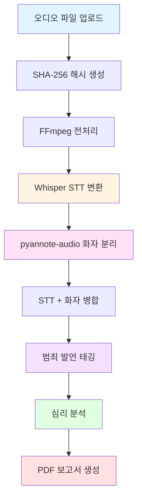

# Voice Man

음성 녹취 증거 분석 시스템

## 개요

Voice Man은 음성 녹취 파일을 텍스트로 변환하고, 법적 증거로 활용 가능한 형태로 분석하는 통합 시스템입니다. 협박, 공갈, 사기, 모욕 등 범죄 발언을 자동으로 태깅하고, 가스라이팅과 같은 심리적 조작 패턴을 감지하여 체계적인 증거 보고서를 생성합니다.

## 핵심 기능

- **오디오 파일 업로드 및 관리**: 다양한 형식의 오디오 파일 지원 (mp3, wav, m4a, flac, ogg)
- **FFmpeg 기반 오디오 전처리**: 오디오 정규화 및 메타데이터 추출
- **Whisper STT 엔진 통합**: 높은 정확도의 음성-텍스트 변환 (WER < 10%)
- **pyannote-audio 화자 분리**: 자동 화자 구분 및 레이블링 (DER < 15%)
- **범죄 발언 자동 태깅**: 협박, 공갈, 사기, 모욕 유형 자동 감지
- **심리 분석**: 가스라이팅 패턴 및 감정 분석
- **법적 증거 보고서 생성**: PDF 형식의 종합 보고서

## 시스템 아키텍처



## 기술 스택

### 백엔드
- **Python 3.13+**: 핵심 개발 언어
- **FastAPI 0.115+**: 고성능 비동기 웹 프레임워크
- **SQLAlchemy 2.0+**: 비동기 ORM
- **Pydantic 2.9+**: 데이터 검증 및 직렬화
- **Uvicorn 0.32+**: ASGI 서버

### 오디오 처리
- **OpenAI Whisper large-v3**: STT 엔진
- **pyannote-audio 3.1+**: 화자 분리
- **FFmpeg 6.0+**: 오디오 전처리

### 데이터베이스
- **SQLite**: 개발 환경
- **PostgreSQL 16+**: 운영 환경 (Phase 2에서 마이그레이션 예정)

### 테스트 및 품질
- **pytest 9.0+**: 테스트 프레임워크
- **pytest-cov 7.0+**: 커버리지 리포트
- **ruff 0.8+**: 린팅 및 포맷팅

## 시스템 요구사항

- Python 3.13+
- CUDA 지원 GPU (권장: NVIDIA RTX 3080+)
- 최소 16GB RAM
- 최소 100GB SSD 저장 공간

## 설치

### 1. 저장소 클론

```bash
git clone https://github.com/yourusername/voice.man.git
cd voice.man
```

### 2. 가상 환경 생성

```bash
python -m venv venv
source venv/bin/activate  # Linux/macOS
# 또는
venv\Scripts\activate  # Windows
```

### 3. 의존성 설치

```bash
pip install -e ".[dev]"
```

### 4. FFmpeg 설치

**macOS**:
```bash
brew install ffmpeg
```

**Ubuntu/Debian**:
```bash
sudo apt update
sudo apt install ffmpeg
```

**Windows**:
FFmpeg 공식 웹사이트에서 다운로드하여 설치하세요.

### 5. 데이터베이스 초기화

```bash
alembic upgrade head
```

## 실행

### 개발 모드

```bash
uvicorn voice_man.main:app --reload --port 8000
```

### 프로덕션 모드

```bash
uvicorn voice_man.main:app --host 0.0.0.0 --port 8000 --workers 4
```

## API 문서

서버 실행 후 다음 URL에서 API 문서를 확인할 수 있습니다:

- **Swagger UI**: `http://localhost:8000/docs`
- **ReDoc**: `http://localhost:8000/redoc`

## 주요 API 엔드포인트

| 엔드포인트 | 메서드 | 설명 |
|------------|--------|------|
| `/health` | GET | 헬스체크 |
| `/api/v1/audio/upload` | POST | 오디오 파일 업로드 |
| `/api/v1/audio/{id}/transcribe` | POST | STT 변환 시작 |
| `/api/v1/audio/{id}/transcript` | GET | 변환 결과 조회 |
| `/api/v1/audio/{id}/speakers` | GET | 화자 분리 결과 조회 |
| `/api/v1/audio/{id}/analysis/crime` | GET | 범죄 발언 태깅 결과 |
| `/api/v1/audio/{id}/analysis/psychology` | GET | 심리 분석 결과 |
| `/api/v1/audio/{id}/report` | POST/GET | 증거 보고서 생성/다운로드 |

## 테스트

### 모든 테스트 실행

```bash
pytest
```

### 커버리지 리포트 생성

```bash
pytest --cov=voice_man --cov-report=html
```

### 특정 테스트 실행

```bash
pytest tests/unit/test_services.py
```

## 프로젝트 구조

```
voice.man/
├── src/
│   └── voice_man/
│       ├── __init__.py
│       ├── main.py                 # FastAPI 메인 애플리케이션
│       ├── schemas.py              # Pydantic 스키마
│       ├── models/
│       │   ├── database.py         # SQLAlchemy 모델
│       │   └── diarization.py      # 화자 분리 모델
│       └── services/
│           ├── __init__.py
│           └── diarization_service.py  # 화자 분리 서비스
├── tests/
│   ├── unit/                       # 단위 테스트
│   ├── integration/                # 통합 테스트
│   └── acceptance/                 # 인수 테스트
├── docs/                           # 문서
├── data/
│   └── uploads/                    # 업로드된 오디오 파일
├── pyproject.toml                  # 프로젝 설정
├── README.md                       # 이 파일
└── CHANGELOG.md                    # 변경 이력
```

## 문서

- [아키텍처](docs/architecture.md) - 시스템 아키텍처 상세
- [API 레퍼런스](docs/api-reference.md) - API 문서
- [배포 가이드](docs/deployment.md) - 배포 절차
- [개발 가이드](docs/development.md) - 개발 환경 설정
- [인수 조건](docs/acceptance.md) - Gherkin 시나리오

## 라이선스

MIT License

## 기여

기여를 환영합니다! Pull Request를 제출해주세요.

## 연락처

프로젝트 관련 문의는 이슈를 생성해주세요.

---

**SPEC**: [SPEC-VOICE-001](.moai/specs/SPEC-VOICE-001/spec.md)
**버전**: 1.0.0
**상태**: 완료
