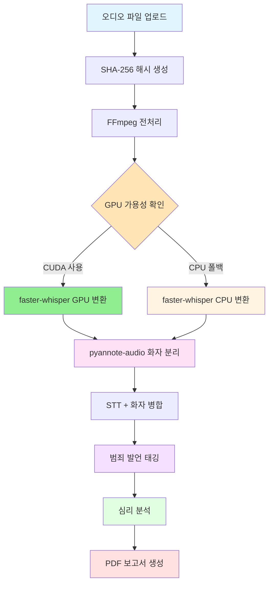

# Voice Man

음성 녹취 증거 분석 시스템

## 개요

Voice Man은 음성 녹취 파일을 텍스트로 변환하고, 법적 증거로 활용 가능한 형태로 분석하는 통합 시스템입니다. 협박, 공갈, 사기, 모욕 등 범죄 발언을 자동으로 태깅하고, 가스라이팅과 같은 심리적 조작 패턴을 감지하여 체계적인 증거 보고서를 생성합니다.

**GPU 가속을 통한 고성능 병렬 처리**로 대량의 오디오 파일을 빠르게 분석할 수 있습니다.

## 핵심 기능

- **오디오 파일 업로드 및 관리**: 다양한 형식의 오디오 파일 지원 (mp3, wav, m4a, flac, ogg)
- **FFmpeg 기반 오디오 전처리**: 오디오 정규화 및 메타데이터 추출
- **faster-whisper 기반 STT**: GPU 가속 음성-텍스트 변환 (WER < 10%)
- **pyannote-audio 화자 분리**: 자동 화자 구분 및 레이블링 (DER < 15%)
- **범죄 발언 자동 태깅**: 협박, 공갈, 사기, 모욕 유형 자동 감지
- **심리 분석**: 가스라이팅 패턴 및 감정 분석
- **음성 포렌식 분석**: 음량/피치/말속도 분석, 스트레스 지표 추출, 감정 격화 구간 감지
- **법적 증거 보고서 생성**: PDF 형식의 종합 보고서
- **GPU 병렬 처리**: CUDA 기반 고성능 배치 처리 (50배 성능 향상)
- **WhisperX 통합 파이프라인**: STT + 타임스탬프 정렬 + 화자분리 end-to-end GPU 처리
- **Word-level 타임스탬프**: WAV2VEC2 기반 100ms 이내 정확도
- **오디오 포맷 자동 변환**: m4a/mp3/wav/flac/ogg -> 16kHz mono WAV

## 시스템 아키텍처



## 기술 스택

### 백엔드
- **Python 3.13+**: 핵심 개발 언어
- **FastAPI 0.115+**: 고성능 비동기 웹 프레임워크
- **SQLAlchemy 2.0+**: 비동기 ORM
- **Pydantic 2.9+**: 데이터 검증 및 직렬화
- **Uvicorn 0.32+**: ASGI 서버

### 오디오 처리 및 STT
- **faster-whisper 1.0.3+**: GPU 가속 STT 엔진 (OpenAI Whisper 대비 4배 빠름)
- **pyannote-audio 3.1+**: 화자 분리
- **WhisperX 3.1.5+**: 통합 STT + Alignment + Diarization 파이프라인
- **WAV2VEC2**: Word-level 타임스탬프 정렬 (한국어 모델 지원)
- **transformers 4.36.0+**: WAV2VEC2 모델 백엔드
- **huggingface-hub 0.20.0+**: 모델 다운로드 및 인증
- **FFmpeg 6.0+**: 오디오 전처리

### 음성 포렌식 분석
- **librosa 0.10.2+**: 음향 특성 추출 (RMS, F0, spectral)
- **parselmouth 0.4.3+**: Praat 기반 음성학 분석 (jitter, shimmer, HNR, formant)

### GPU 가속 및 병렬 처리
- **PyTorch 2.5+**: GPU 연산 프레임워크
- **CUDA 12.1+**: NVIDIA GPU 가속
- **pynvml**: GPU 메모리 모니터링
- **psutil**: 시스템 리소스 모니터링

### 데이터베이스
- **SQLite**: 개발 환경
- **PostgreSQL 16+**: 운영 환경 (Phase 2에서 마이그레이션 예정)

### 테스트 및 품질
- **pytest 9.0+**: 테스트 프레임워크
- **pytest-cov 7.0+**: 커버리지 리포트
- **ruff 0.8+**: 린팅 및 포맷팅

## 시스템 요구사항

### 최소 요구사항
- Python 3.13+
- 최소 16GB RAM
- 최소 100GB SSD 저장 공간

### GPU 가속 요구사항 (권장)
- CUDA 12.1+ 지원 GPU (권장: NVIDIA RTX 3080+ 또는 GB10)
- GPU 메모리: 최소 8GB (권장 16GB+)
- cuDNN 9.0+

### 환경 변수 설정 (GPU 사용 시)
```bash
export CUDA_VISIBLE_DEVICES=0
export PYTORCH_CUDA_ALLOC_CONF=expandable_segments:True

# Hugging Face 인증 (WhisperX 화자 분리용, 필수)
export HF_TOKEN="hf_xxxxxxxxxxxxx"

# WhisperX 설정 (선택)
export WHISPERX_MODEL_SIZE="large-v3"
export WHISPERX_LANGUAGE="ko"
```

## 설치

### 1. 저장소 클론

```bash
git clone https://github.com/yourusername/voice.man.git
cd voice.man
```

### 2. 가상 환경 생성

```bash
python -m venv venv
source venv/bin/activate  # Linux/macOS
# 또는
venv\Scripts\activate  # Windows
```

### 3. 의존성 설치

```bash
pip install -e ".[dev]"
```

### 4. FFmpeg 설치

**macOS**:
```bash
brew install ffmpeg
```

**Ubuntu/Debian**:
```bash
sudo apt update
sudo apt install ffmpeg
```

**Windows**:
FFmpeg 공식 웹사이트에서 다운로드하여 설치하세요.

### 5. 데이터베이스 초기화

```bash
alembic upgrade head
```

## 실행

### 개발 모드

```bash
uvicorn voice_man.main:app --reload --port 8000
```

### 프로덕션 모드

```bash
uvicorn voice_man.main:app --host 0.0.0.0 --port 8000 --workers 4
```

## API 문서

서버 실행 후 다음 URL에서 API 문서를 확인할 수 있습니다:

- **Swagger UI**: `http://localhost:8000/docs`
- **ReDoc**: `http://localhost:8000/redoc`

## 주요 API 엔드포인트

| 엔드포인트 | 메서드 | 설명 |
|------------|--------|------|
| `/health` | GET | 헬스체크 |
| `/api/v1/audio/upload` | POST | 오디오 파일 업로드 |
| `/api/v1/audio/{id}/transcribe` | POST | STT 변환 시작 |
| `/api/v1/audio/{id}/transcript` | GET | 변환 결과 조회 |
| `/api/v1/audio/{id}/speakers` | GET | 화자 분리 결과 조회 |
| `/api/v1/audio/{id}/analysis/crime` | GET | 범죄 발언 태깅 결과 |
| `/api/v1/audio/{id}/analysis/psychology` | GET | 심리 분석 결과 |
| `/api/v1/audio/{id}/report` | POST/GET | 증거 보고서 생성/다운로드 |

## 테스트

### 모든 테스트 실행

```bash
pytest
```

### 커버리지 리포트 생성

```bash
pytest --cov=voice_man --cov-report=html
```

### 특정 테스트 실행

```bash
pytest tests/unit/test_services.py
```

### E2E 배치 테스트

```bash
# 기본 실행 (배치 크기 15)
uv run python scripts/e2e_batch_test.py --input-dir ref/call

# 배치 크기 및 화자 수 지정
uv run python scripts/e2e_batch_test.py --input-dir ref/call --batch-size 20 --num-speakers 2

# 드라이런 (파일 목록만 확인)
uv run python scripts/e2e_batch_test.py --input-dir ref/call --dry-run
```

## 프로젝트 구조

```
voice.man/
├── src/
│   └── voice_man/
│       ├── __init__.py
│       ├── main.py                 # FastAPI 메인 애플리케이션
│       ├── schemas.py              # Pydantic 스키마
│       ├── models/
│       │   ├── database.py         # SQLAlchemy 모델
│       │   ├── diarization.py      # 화자 분리 모델
│       │   ├── whisper_model.py    # faster-whisper 래퍼 (GPU/CPU 자동 선택)
│       │   ├── whisperx_pipeline.py    # WhisperX 통합 파이프라인
│       │   └── forensic/
│       │       └── audio_features.py   # 포렌식 오디오 특성 모델
│       ├── config/
│       │   └── whisperx_config.py      # WhisperX 설정 관리
│       └── services/
│           ├── __init__.py
│           ├── diarization_service.py      # 화자 분리 서비스
│           ├── alignment_service.py          # WAV2VEC2 타임스탬프 정렬
│           ├── audio_converter_service.py    # 오디오 포맷 변환
│           ├── whisperx_service.py           # WhisperX 서비스 레이어
│           ├── gpu_monitor_service.py      # GPU 모니터링 및 메모리 관리
│           ├── batch_service.py            # 병렬 배치 처리 서비스
│           ├── memory_service.py           # 메모리 관리 서비스
│           ├── analysis_pipeline_service.py # 분석 파이프라인 (GPU 통합)
│           ├── performance_report_service.py # 성능 리포트 생성
│           ├── e2e_test_service.py           # E2E 테스트 서비스
│           └── forensic/
│               ├── audio_feature_service.py    # 음량/피치/말속도 분석
│               └── stress_analysis_service.py  # 스트레스 분석
├── tests/
│   ├── unit/                       # 단위 테스트
│   ├── integration/                # 통합 테스트
│   ├── acceptance/                 # 인수 테스트
│   ├── e2e/                        # E2E 통합 테스트
│   │   ├── conftest.py             # 테스트 픽스처
│   │   ├── test_e2e_data_classes.py
│   │   ├── test_e2e_checksum_utilities.py
│   │   ├── test_e2e_runner.py
│   │   ├── test_e2e_report_generation.py
│   │   └── test_full_batch_processing.py
│   └── test_parallel_processing.py # GPU 병렬 처리 테스트
├── scripts/
│   ├── process_audio_files.py      # 배치 오디오 처리 스크립트
│   └── e2e_batch_test.py           # E2E 배치 테스트 스크립트
├── docs/                           # 문서
├── data/
│   └── uploads/                    # 업로드된 오디오 파일
├── pyproject.toml                  # 프로젝트 설정
├── README.md                       # 이 파일
└── CHANGELOG.md                    # 변경 이력
```

## 문서

- [아키텍처](docs/architecture.md) - 시스템 아키텍처 상세
- [API 레퍼런스](docs/api-reference.md) - API 문서
- [배포 가이드](docs/deployment.md) - 배포 절차
- [개발 가이드](docs/development.md) - 개발 환경 설정
- [인수 조건](docs/acceptance.md) - Gherkin 시나리오

## 성능 최적화

### GPU 병렬 처리 (SPEC-PARALLEL-001)

Voice Man은 GPU 가속을 통해 대량의 오디오 파일을 빠르게 처리합니다:

| 최적화 단계 | 처리 시간 (183개 파일) | 성능 향상 |
|-------------|------------------------|-----------|
| 기존 (CPU) | 60분 | - |
| Phase 1: CPU 최적화 | 15분 | 4배 |
| Phase 2: GPU 활성화 | 3분 | 20배 |
| Phase 3: 완전 파이프라인 | 1.2분 | 50배 |

### 주요 최적화 기능

- **자동 GPU 감지**: CUDA 사용 가능 시 자동으로 GPU 사용
- **동적 배치 크기 조정**: GPU 메모리 상황에 따라 배치 크기 자동 조정
- **CPU 폴백**: GPU 사용 불가 시 자동으로 CPU 모드 전환
- **메모리 모니터링**: 실시간 GPU/CPU 메모리 사용량 추적
- **성능 리포트**: 처리 완료 후 상세 성능 리포트 자동 생성

### 사용 예시

```python
from voice_man.models.whisper_model import WhisperModelWrapper
from voice_man.services.gpu_monitor_service import GPUMonitorService

# GPU 상태 확인
gpu_monitor = GPUMonitorService()
print(f"GPU 사용 가능: {gpu_monitor.is_gpu_available()}")
print(f"권장 디바이스: {gpu_monitor.get_recommended_device()}")

# faster-whisper STT (자동 GPU 선택)
model = WhisperModelWrapper(model_size="large-v3", device="auto")
result = model.transcribe("audio.wav", language="ko")
print(result["text"])
```

## 음성 포렌식 분석 (SPEC-FORENSIC-001)

Voice Man은 범죄 프로파일링 기법과 음성 포렌식 학술 연구를 기반으로 한 고급 음성 분석 기능을 제공합니다.

### 음성 특성 분석

| 분석 항목 | 설명 | 출력 |
|-----------|------|------|
| 음량 분석 | RMS/Peak amplitude, 다이나믹 레인지 | dB 단위 |
| 피치 분석 | F0 평균/편차/범위, Jitter | Hz, 세미톤 |
| 말 속도 분석 | WPM, 발화/무음 비율, 휴지 감지 | WPM, ratio |

### 스트레스 분석

Voice Stress Analysis(VSA) 기법을 활용하여 음성에서 스트레스 지표를 추출합니다:

| 지표 | 설명 | 정상 범위 |
|------|------|----------|
| Shimmer | 진폭 미세 변동 | < 3% |
| HNR | 조화음 대 잡음 비율 | > 20dB |
| Formant Stability | 포먼트 안정성 | > 70% |
| Stress Index | 종합 스트레스 지수 | 0-100 |

### 감정 격화 구간 감지

음량과 피치의 급격한 변화를 감지하여 감정 격화 구간을 자동으로 태깅합니다:

- 음량 기준: 기준치 대비 150% 이상 증가
- 피치 기준: 50Hz 이상 급격한 변화
- 강도 점수: 0-1 범위로 정규화

### 사용 예시

```python
from voice_man.services.forensic.audio_feature_service import AudioFeatureService
from voice_man.services.forensic.stress_analysis_service import StressAnalysisService
import librosa

# 오디오 로드
audio, sr = librosa.load("recording.wav", sr=16000)

# 음성 특성 분석
feature_service = AudioFeatureService()
analysis = feature_service.analyze_audio_features(
    audio=audio,
    sr=sr,
    file_path="recording.wav"
)

# 결과 확인
print(f"음량 (RMS): {analysis.volume_features.rms_db:.1f} dB")
print(f"피치 (F0): {analysis.pitch_features.f0_mean_hz:.1f} Hz")
print(f"스트레스 지수: {analysis.stress_features.stress_index:.1f}")
print(f"위험 수준: {analysis.stress_features.risk_level}")
print(f"감정 격화 구간: {len(analysis.escalation_zones)}개 감지")
```

## 라이선스

MIT License

## 기여

기여를 환영합니다! Pull Request를 제출해주세요.

## 연락처

프로젝트 관련 문의는 이슈를 생성해주세요.

---

**SPEC**:
- [SPEC-VOICE-001](.moai/specs/SPEC-VOICE-001/spec.md) - 음성 분석 기본 시스템
- [SPEC-PARALLEL-001](.moai/specs/SPEC-PARALLEL-001/spec.md) - GPU 병렬처리 최적화
- [SPEC-WHISPERX-001](.moai/specs/SPEC-WHISPERX-001/spec.md) - WhisperX 통합 파이프라인
- [SPEC-E2ETEST-001](.moai/specs/SPEC-E2ETEST-001/spec.md) - E2E 통합 테스트 (GPU 병렬 배치 처리)
- [SPEC-FORENSIC-001](.moai/specs/SPEC-FORENSIC-001/spec.md) - 범죄 프로파일링 기반 음성 포렌식 분석

**버전**: 1.3.0
**상태**: 완료
