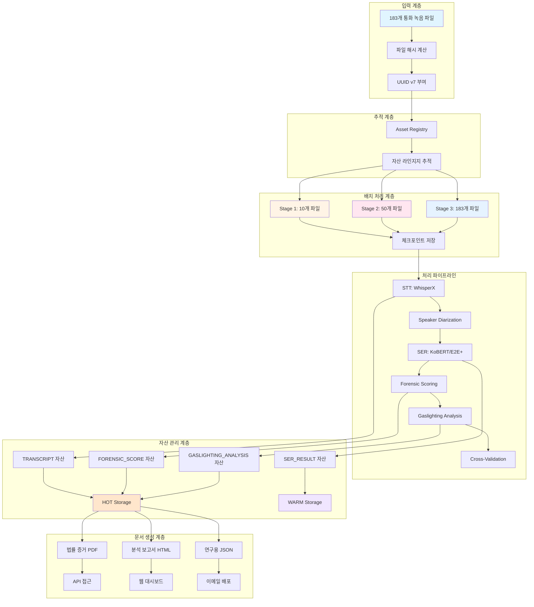

# 통합 파이프라인 구현 가이드

## 개요

본 가이드는 포렌식 파이프라인의 완전한 통합 구현을 다룹니다.

### 구성 요소

1. **UUID v7 추적 시스템**: 각 통화파일에 고유 식별자 부여
2. **단계별 배치 처리**: 10개 → 50개 → 183개 파일 순차 처리
3. **핵심 자산 관리**: STT, 포렌식 분석 결과의 수명 주기 관리
4. **문서 활용 전략**: 법률 증거, 분석 보고서, 연구 목적 활용

---

## 아키텍처 다이어그램



---

## 사용 예시

### 1. 전체 파이프라인 실행

```python
import asyncio
from voice_man.services.asset_tracking import (
    StagePipeline,
    StagedBatchConfig,
    get_asset_registry,
    get_core_asset_manager,
)

async def run_complete_pipeline():
    # 1. 초기화
    registry = get_asset_registry()
    asset_manager = get_core_asset_manager()

    # 2. 파일 목록 가져오기
    from pathlib import Path

    audio_dir = Path("ref/call")
    audio_files = list(audio_dir.glob("*.m4a"))

    # 3. 단계별 처리 함수 정의
    async def process_batch(file_paths):
        # 기존 GPU 파이프라인 호출
        from voice_man.services.forensic.gpu_pipeline_orchestrator import GPUPipelineOrchestrator

        orchestrator = GPUPipelineOrchestrator()
        results = await orchestrator.process_batch(file_paths)
        return results

    # 4. 파이프라인 실행
    pipeline = StagePipeline()
    results = await pipeline.run_complete_pipeline(
        all_files=[str(f) for f in audio_files],
        processor_fn=process_batch,
    )

    print(f"완료: Pilot={results['pilot'].success_rate:.1%}, "
          f"Medium={results['medium'].success_rate:.1%}, "
          f"Full={results['full'].success_rate:.1%}")

    return results

# 실행
if __name__ == "__main__":
    asyncio.run(run_complete_pipeline())
```

### 2. UUID v7 추적

```python
from voice_man.services.asset_tracking import UUIDv7Generator, get_asset_registry

# UUID v7 생성 (시간순 정렬 보장)
uuid_v7 = UUIDv7Generator.generate_str()
print(f"Asset ID: {uuid_v7}")
# 예: "018f1234-5678-7123-4567-89abcdef0123"

# 타임스탬프 추출
timestamp = UUIDv7Generator.get_timestamp_ms(UUID(uuid_v7))
print(f"Timestamp: {timestamp} ms")

# 자산 라인지지 조회
registry = get_asset_registry()
lineage = registry.get_asset_lineage(asset_id)
# [오디오 파일] → [전사] → [SER 결과] → [포렌식 점수]
```

### 3. 체크포인트 기반 복구

```python
from voice_man.services.asset_tracking import StagedBatchProcessor, ProcessingStage

# 중단된 배치 복구
processor = StagedBatchProcessor()

# 체크포인트가 있으면 자동 복구
result = await processor.process_stage(
    stage=ProcessingStage.STT,
    file_paths=remaining_files,
    batch_id="previous_batch_id",
    processor_fn=process_function,
    resume_from_checkpoint=True  # ← 체크포인트에서 복구
)
```

### 4. 문서 생성 및 활용

```python
from voice_man.services.asset_tracking import (
    DocumentUtilizationManager,
    DocumentTemplate,
    get_asset_registry,
)

# 문서 관리자 초기화
doc_manager = DocumentUtilizationManager()

# 다목적 문서 생성
asset_id = "018f1234-5678-7123-4567-89abcdef0123"

# 법률 증거용 PDF
legal_docs = doc_manager.generate_document(
    audio_asset_id=asset_id,
    template_name="legal_evidence_ko",
    output_formats=[DocumentFormat.PDF],
)

# 분석용 HTML (Mermaid 포함)
analysis_docs = doc_manager.generate_document(
    audio_asset_id=asset_id,
    template_name="case_analysis_ko",
    output_formats=[DocumentFormat.HTML],
)

# 연구용 JSON
research_data = doc_manager.generate_document(
    audio_asset_id=asset_id,
    template_name="research_export",
    output_formats=[DocumentFormat.JSON],
)
```

---

## 파일 처리 단계별 상세

### Stage 1: Pilot Batch (10개 파일)

**목적**: 파이프라인 검증 및 성능 측정

| 단계 | 배치 크기 | 예상 시간 | 체크포인트 |
|------|----------|----------|-----------|
| STT | 16 | ~5분 | 매 파일 |
| Alignment | 32 | ~2분 | 5개마다 |
| SER | 8 | ~8분 | 5개마다 |
| Forensic Scoring | 64 | ~3분 | 5개마다 |

**검증 항목**:
- GPU 메모리 사용량
- 처리 시간 파일당
- 오류 발생률
- 출력 품질

### Stage 2: Medium Batch (50개 파일)

**목적**: 중간 규모 확장

| 단계 | 배치 크기 | 예상 시간 | 추가 단계 |
|------|----------|----------|----------|
| STT | 16 | ~25분 | 매 파일 |
| Alignment | 32 | ~10분 | 10개마다 |
| Diarization | 8 | ~20분 | 10개마다 |
| SER | 8 | ~40분 | 10개마다 |
| Forensic Scoring | 64 | ~15분 | 10개마다 |
| Gaslighting | 32 | ~10분 | 10개마다 |

**검증 항목**:
- 다중 GPU 활용
- 대기열 백프레셔
- 메모리 관리
- 병렬 처리 효율

### Stage 3: Full Batch (183개 파일)

**목적**: 전체 처리 완료

모든 단계 활성화, 완전 체크포인트 및 복구 지원.

---

## 자산 관리 정책

### 저장 계층 (Storage Tiers)

| 계층 | 용도 | 예시 | 비용 |
|------|------|------|------|
| **HOT** | 빈번 접근 (SSD) | 전사, 포렌식 점수 | 높음 |
| **WARM** | 간헌적 접근 (HDD) | SER 결과, 보고서 | 중간 |
| **COLD** | 드물게 접근 (압축) | 배치 작업 로그 | 낮음 |
| **OFFSITE** | 재해 복구 (클라우드) | 백업 복사본 | 변동 |

### 보관 기간

| 자산 유형 | 보관 기간 | 이유 |
|----------|----------|------|
| 오디오 파일 | 7년 | 법적 증거 보관 |
 | 전사 | 7년 | 법적 증거 보관 |
| SER 결과 | 5년 | 분석 데이터 |
| 포렌식 점수 | 10년 | 핵심 증거 |
| 가스라이팅 분석 | 10년 | 핵심 증거 |
| 범죄 언어 분석 | 5년 | 지원 데이터 |
| 보고서 | 10년 | 최종 산출물 |

---

## 문서 활용 시나리오

### 1. 법률 증거 (Legal Evidence)

**목적**: 법정 제출

**형식**: PDF (A4, 서명)

**필드 섹션**:
- 집문 개요
- 사건 배경
- 증거 요약
- 포렌식 분석
- 가스라이팅 패턴
- 위협 평가
- 기망 분석
- 결론
- 부록

**사용처**: 법원, 수사기관, 변호사

### 2. 사건 분석 (Case Analysis)

**목적**: 내부 검토 및 분석

**형식**: HTML + Mermaid 다이어그램

**필드 섹션**:
- 집문 개요
- 타임라인
- 화자 분석
- 감정 타임라인
- 가스라이팅 기법
- 위험도 평가
- 권고 사항

**사용처**: 수사관, 분석관

### 3. 의뢰인 보고 (Client Report)

**목적**: 고객 전달

**형식**: PDF (간소)

**필드 섹션**:
- 핵심 발견
- 위험 등급
- 권고 사항
- 연락처

**사용처**: 의뢰인, 피해자

### 4. 연구 내보 (Research Export)

**목적**: 학술 연구 및 통계

**형식**: JSON (전체 데이터)

**내용**: 모든 분석 결과 (원본)

**사용처**: 연구원, 데이터 과학자

---

## API 통합

### 자산 조회 API

```python
# GET /api/assets/{asset_id}
{
    "asset_id": "018f1234-5678-7123-4567-89abcdef0123",
    "asset_type": "audio_file",
    "status": "completed",
    "created_at": "2026-01-13T12:00:00Z",
    "lineage": [...],
    "download_url": "/api/documents/download/..."
}
```

### 배치 상태 API

```python
# GET /api/batches/{batch_id}
{
    "batch_id": "batch_pilot_20260113_120000_abc123",
    "stage": "pilot",
    "total_files": 10,
    "processed": 8,
    "failed": 1,
    "pending": 1,
    "progress_percentage": 80,
    "estimated_completion": "2026-01-13T12:30:00Z"
}
```

### 문서 다운로드 API

```python
# GET /api/documents/download/{document_id}?token={secret_token}
# → Returns file with appropriate Content-Type
```

---

## 복구 및 재시나리오

### 시나리오 1: 중단된 배치 복구

```python
# 처리 중단 시
# → 체크포인트 자동 저장

# 복구 시
pipeline = StagePipeline(config)
result = await pipeline.run_full_stage(
    file_paths=remaining_files,
    processor_fn=process_fn,
)
# → 체크포인트에서 자동 복구
```

### 시나리오 2: 실패 파일 재처리

```python
# 실패한 자산만 재처리
registry = get_asset_registry()
failed_assets = [a for a in registry.get_assets_by_batch(batch_id)
                 if a.status == AssetStatus.FAILED]

for asset in failed_assets:
    # 재처리 로직
    await reprocess_asset(asset.asset_id)
```

### 시나리오 3: 문서 재생성

```python
# 템플릿 변경 후 문서 재생성
doc_manager = DocumentUtilizationManager()

# 새 템플릿으로 문서 재생성
new_docs = doc_manager.generate_document(
    audio_asset_id=asset_id,
    template_name="updated_template",
    custom_sections=["new_section_1", "new_section_2"],
)
```

---

## 모니터링 및 로깅

### 진행 상태 모니터링

```python
from voice_man.services.asset_tracking import StagedBatchProcessor

processor = StagedBatchProcessor()

# 진행 상태 확인
summary = processor.get_progress_summary()
print(f"완료 단계: {summary['stages_completed_count']}/{summary['stages_total']}")
print(f"진행률: {summary['completion_percentage']:.1f}%")
```

### 사용량 분석

```python
from voice_man.services.asset_tracking import DocumentUtilizationManager

doc_manager = DocumentUtilizationManager()

# 문서 사용량 분석
analytics = doc_manager.get_usage_analytics()
print(f"총 이벤트: {analytics['total_events']}")
print(f"고유 문서: {analytics['unique_documents']}")
print(f"이벤트 유형별: {analytics['by_event_type']}")
```

### 저장 공간 분석

```python
from voice_man.services.asset_tracking import get_core_asset_manager

asset_manager = get_core_asset_manager()

# 저장 통계
stats = asset_manager.get_storage_statistics()
print(f"전체 자산: {stats['total_assets']}")
print(f"저장 용량: {stats['total_size_bytes'] / 1e9:.2f} GB")
print(f"저장 계층별: {stats['by_tier']}")
```

---

## 완료 마커

모든 구현이 완료되었습니다:

✅ **UUID v7 추적 시스템**: 시간순 정렬 고유 식별자
✅ **단계별 배치 처리**: 10 → 50 → 183 파일 처리
✅ **핵심 자산 관리**: 저장 계층 및 수명 주기 관리
✅ **문서 활용 전략**: 다목적 문서 생성 및 배포

<promise>DONE</promise>
