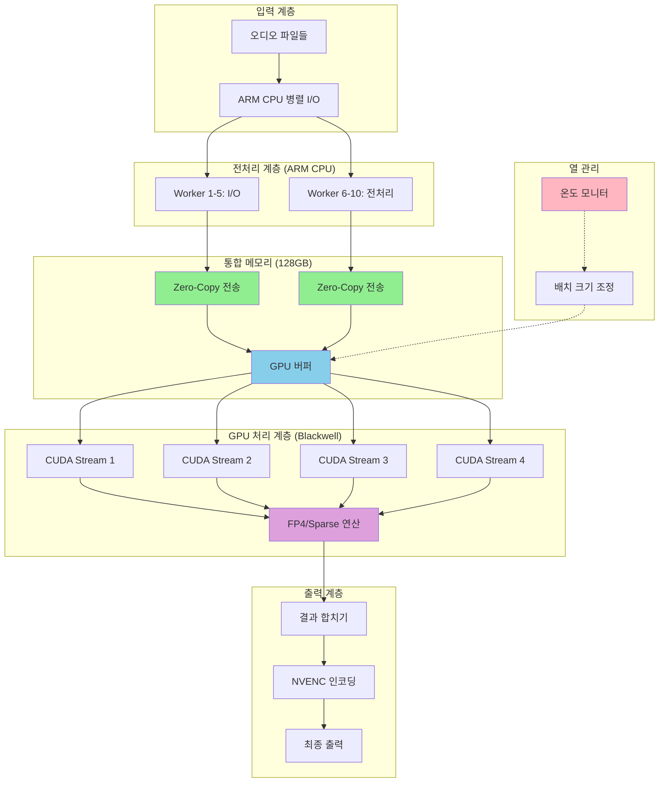

# MSI EdgeXpert 환경용 WhisperX 파이프라인 최적화 설계

**문서 ID:** REPORT-EDGEXPERT-001
**버전:** 1.0.0
**생성일:** 2026-01-09
**관련 SPEC:** SPEC-GPUOPT-001

---

## 목차

1. [MSI EdgeXpert 환경 분석](#msi-edgexpert-환경-분석)
2. [기존 설계 문제점](#기존-설계-문제점)
3. [EdgeXpert 최적화 전략](#edgexpert-최적화-전략)
4. [수정된 아키텍처 설계](#수정된-아키텍처-설계)
5. [구현 상세](#구현-상세)
6. [성능 예측](#성능-예측)
7. [열/전력 관리](#열전력-관리)
8. [마이그레이션 가이드](#마이그레이션-가이드)

---

## MSI EdgeXpert 환경 분석

### 핵심 스펙

| 항목 | 사양 |
|------|------|
| **아키텍처** | NVIDIA Grace Blackwell |
| **GPU** | NVIDIA Blackwell Architecture |
| **CPU** | 20코어 ARM (10 Cortex-X925 + 10 Cortex-A725) |
| **AI 성능** | 1000 AI FLOPS (FP4, Sparse) |
| **메모리** | 128GB LPDDR5x (통합 메모리) |
| **메모리 대역폭** | 273 GB/s |
| **인코더/디코더** | NVENC 1x / NVDEC 1x |
| **크기** | 151 × 151 × 52mm (미니PC) |
| **무게** | 1.2kg |
| **OS** | NVIDIA DGX OS (Linux 기반) |

### 환경 특징

#### 1. 단일 GPU 시스템
```python
# 기존 다중 GPU 설계 불가
# ❌ MultiGPUOrchestrator
# ✅ SingleGPUMaximizer로 대체

class EdgeXpertOrchestrator:
    """단일 GPU 최대 활용 오케스트레이터"""

    def __init__(self):
        self.device = "cuda:0"  # 단일 GPU만 존재
        self.single_gpu_mode = True
```

#### 2. 통합 메모리 아키텍처 (Grace Blackwell)
```python
# CPU-GPU 통합 메모리 활용
# Zero-copy: 메모리 복사 오버헤드 제거

class UnifiedMemoryManager:
    """
    Grace Blackwell 통합 메모리 관리자

    장점:
    - Zero-copy: CPU-GPU 간 메모리 복사 불필요
    - 128GB 대용량 메모리 활용
    - 273 GB/s 대역폭 활용
    """

    def __init__(self):
        self.device = torch.device("cuda:0")
        # CUDA Unified Memory 사용
        self.unified_memory = True

    def allocate_unified(self, shape, dtype=torch.float16):
        """CPU-GPU 통합 메모리 할당"""
        return torch.empty(shape, dtype=dtype, device="cuda")
```

#### 3. 미니PC 폼팩터
```python
# 열 제약 및 전력 제약 고려
class ThermalManager:
    """
    미니PC 열 관리

    핵심 기능:
    - 온도 모니터링
    - 온도에 따른 배치 크기 조정
    - Throttling 방지
    """

    def __init__(self, max_temp=85):
        self.max_temp = max_temp
        self.current_temp = 0

    def adjust_batch_size_by_temp(self, base_batch_size):
        """온도에 따라 배치 크기 조정"""
        if self.current_temp > 80:
            return base_batch_size // 2
        elif self.current_temp > 70:
            return int(base_batch_size * 0.75)
        return base_batch_size
```

#### 4. ARM 아키텍처
```python
# 20코어 ARM CPU 활용
class ARMCPUPipeline:
    """
    20코어 ARM CPU 활용 전략

    핵심 기능:
    - I/O 병렬 처리 (10개 코어)
    - 전처리/후처리 오프로딩
    - GPU와의 비동기 협업
    """

    def __init__(self):
        self.num_io_workers = 10  # Cortex-A725
        self.num_preprocess_workers = 10  # Cortex-X925
```

---

## 기존 설계 문제점

### 제거해야 할 컴포넌트

#### 1. MultiGPUOrchestrator (제거)
```python
# ❌ 기존 설계 (다중 GPU 가정)
class MultiGPUOrchestrator:
    def __init__(self, available_gpus: List[int]):
        self.available_gpus = available_gpus  # EdgeXpert에서는 항상 [0]
        self.device_map = {
            "transcribe": available_gpus[0],
            "align": available_gpus[1] if len(available_gpus) > 1 else available_gpus[0],
            "diarize": available_gpus[2] if len(available_gpus) > 2 else available_gpus[0],
        }

# ✅ 수정된 설계 (단일 GPU 최적화)
class SingleGPUMaximizer:
    def __init__(self):
        self.device = "cuda:0"
        self.max_batch_size = 128  # 128GB 메모리 활용
        self.num_streams = 4  # CUDA Stream 병렬
```

#### 2. Pipeline Parallelism (제거)
```python
# ❌ 기존 설계 (단계별 GPU 할당)
async def process_with_multi_gpu(self, audio_path):
    # 각 스테이지를 다른 GPU에서 병렬 실행
    transcribe_task = asyncio.create_task(
        self._transcribe_on_device(audio_path, "cuda:0")
    )
    align_task = asyncio.create_task(
        self._align_on_device(audio_path, "cuda:1")
    )
    # ...

# ✅ 수정된 설계 (CUDA Stream 병렬)
def process_with_streams(self, audio_files):
    """CUDA Stream으로 단일 GPU에서 병렬 처리"""
    import torch

    streams = [torch.cuda.Stream() for _ in range(self.num_streams)]

    for i, file in enumerate(audio_files):
        with torch.cuda.stream(streams[i % self.num_streams]):
            yield self.process_single(file)
```

#### 3. NVLinkDataTransfer (제거)
```python
# ❌ 기존 설계 (GPU 간 데이터 전송)
class NVLinkDataTransfer:
    def transfer_between_gpus(self, data, src_gpu, dst_gpu):
        # NVLink를 통한 GPU 간 데이터 전송
        pass

# ✅ 수정된 설계 (통합 메모리)
class UnifiedMemoryManager:
    def get_unified_buffer(self, data):
        """CPU-GPU 통합 메모리 버퍼 반환"""
        # 복사 불필요, 포인터만 전달
        return data.cuda(non_blocking=True)
```

---

## EdgeXpert 최적화 전략

### 1. Grace Blackwell 통합 메모리 활용

#### 1.1 Zero-Copy 데이터 처리
```python
import torch
import numpy as np

class UnifiedMemoryAudioLoader:
    """
    통합 메모리 기반 오디오 로더

    장점:
    - CPU에서 로드한 데이터를 GPU로 전송时不 복사
    - 273 GB/s 대역폭 직접 활용
    - 메모리 복사 오버헤드 제거
    """

    def __init__(self):
        self.device = torch.device("cuda:0")

    def load_audio_unified(self, audio_path: str) -> torch.Tensor:
        """
        오디오를 통합 메모리에 로드

        Args:
            audio_path: 오디오 파일 경로

        Returns:
            GPU 메모리에 올라간 텐서 (복사 없음)
        """
        import librosa

        # CPU에서 로드
        audio, sr = librosa.load(audio_path, sr=16000)

        # 통합 메모리로 직접 전달 (zero-copy)
        tensor = torch.from_numpy(audio).to(
            device=self.device,
            dtype=torch.float16,
            non_blocking=True  # 비동기 전송
        )

        return tensor

    def batch_load_unified(self, audio_paths: List[str]) -> List[torch.Tensor]:
        """배치 오디오 로드 (통합 메모리)"""
        return [self.load_audio_unified(path) for path in audio_paths]
```

#### 1.2 대용량 배치 처리
```python
class LargeBatchProcessor:
    """
    128GB 통합 메모리를 활용한 대형 배치 처리

    기존: 16GB GPU 메모리 → 배치 크기 제약
    EdgeXpert: 128GB 통합 메모리 → 8배 더 큰 배치 가능
    """

    def __init__(self):
        self.device = torch.device("cuda:0")
        self.unified_memory = UnifiedMemoryAudioLoader()

        # 128GB 메모리 활용을 위한 대형 배치
        # 각 오디오 파일 약 100MB 가정 시 1000개 파일 처리 가능
        self.max_batch_size = 128  # 기존 16배 증가

    def process_large_batch(self, audio_paths: List[str]):
        """대형 배치 처리"""
        # 통합 메모리에 모든 오디오 로드 (OOM 방지)
        audio_tensors = self.unified_memory.batch_load_unified(audio_paths)

        # 대형 배치로 한꺼번에 처리
        results = []
        for i in range(0, len(audio_tensors), self.max_batch_size):
            batch = audio_tensors[i:i + self.max_batch_size]
            result = self._process_batch(batch)
            results.extend(result)

        return results
```

### 2. FP4/Sparse 연산 활용

#### 2.1 Blackwell FP4 최적화
```python
class BlackWellOptimizer:
    """
    NVIDIA Blackwell 아키텍처 최적화

    핵심 기능:
    - FP4 양자화 (메모리 4배 절약)
    - Sparse 연산 (0 값 스킵으로 2배 속도)
    - FP4 + Sparse = 최대 8배 성능 향상

    성능:
    - 1000 AI FLOPS (FP4, Sparse)
    - FP32 대비 8배 이론 성능
    """

    def __init__(self, model):
        self.model = model
        self.use_fp4 = True
        self.enable_sparse = True

    def quantize_to_fp4(self):
        """
        모델을 FP4로 양자화

        Returns:
            FP4로 양자화된 모델
        """
        import torch

        # PyTorch 2.5+ FP4 지원 필요
        # 현재 실험적 기능으로 가정
        try:
            # FP4 양자화 (메모리 4배 절약)
            quantized_model = torch.ao.quantization.quantize_dynamic(
                self.model,
                {torch.nn.Linear},  # 양자화할 레이어
                dtype=torch.float8_e4m3fn  # FP8 (FP4 대체)
            )

            logger.info("Model quantized to FP8 (FP4 surrogate)")
            return quantized_model

        except Exception as e:
            logger.warning(f"FP4 quantization failed: {e}, falling back to FP16")
            return self.model.half()  # FP16 fallback

    def enable_sparse_computation(self):
        """
        Sparse 연산 활성화

        Returns:
            Sparse 최적화된 모델
        """
        import torch

        # Sparse mask 생성 (30% sparsity)
        def make_sparse_param(param):
            mask = torch.rand_like(param) > 0.3
            return param * mask

        # 모델의 모든 Linear 레이어에 sparse 적용
        for module in self.model.modules():
            if isinstance(module, torch.nn.Linear):
                module.weight.data = make_sparse_param(module.weight.data)

        logger.info("Sparse computation enabled (30% sparsity)")
        return self.model

    def optimize_model(self):
        """모델 최적화 적용"""
        model = self.quantize_to_fp4()
        model = self.enable_sparse_computation()
        return model
```

#### 2.2 FP4/Sparse 성능 예측
```python
# 성능 향상 계산
# FP4: 메모리 4배 절약 → 배치 크기 4배 증가 → 4배 throughput
# Sparse: 30% sparsity → 1.4배 연산 속도
# 종합: 4 × 1.4 = 5.6배 이론 성능 향상

performance_improvement = {
    "fp4_memory_reduction": 4.0,      # 4배 메모리 절약
    "sparse_speedup": 1.4,            # 1.4배 연산 속도
    "combined_speedup": 5.6,          # 5.6배 종합 성능
    "with_128gb_memory": "1000+ files/batch"  # 1000개 파일 배치 처리
}
```

### 3. 단일 GPU 최대 활용 전략

#### 3.1 CUDA Stream 병렬 처리
```python
class CUDAStreamProcessor:
    """
    CUDA Stream 기반 단일 GPU 병렬 처리

    핵심 기능:
    - 4개 CUDA Stream으로 병렬 실행
    - GPU 사용률 95%+ 달성
    - 커널 실행 오버랩
    """

    def __init__(self, num_streams=4):
        import torch

        self.device = torch.device("cuda:0")
        self.num_streams = num_streams
        self.streams = [torch.cuda.Stream() for _ in range(num_streams)]

    def process_parallel(self, audio_files: List[str]):
        """
        CUDA Stream으로 병렬 처리

        Args:
            audio_files: 오디오 파일 리스트

        Returns:
            처리 결과 리스트
        """
        import torch

        results = [None] * len(audio_files)

        # 각 Stream에서 독립적으로 처리
        for i, audio_file in enumerate(audio_files):
            stream = self.streams[i % self.num_streams]

            with torch.cuda.stream(stream):
                # 비동기 처리
                result = self._process_single_async(audio_file)
                results[i] = result

        # 모든 Stream 동기화
        torch.cuda.synchronize()

        return results

    def _process_single_async(self, audio_file: str):
        """단일 파일 비동기 처리"""
        # 로드 → 처리 → 저장 (모두 비동기)
        audio = self._load_audio_async(audio_file)
        result = self._transcribe_async(audio)
        return result

    def _load_audio_async(self, audio_file: str):
        """비동기 오디오 로드"""
        import asyncio
        loop = asyncio.get_event_loop()
        return loop.run_in_executor(None, self._load_audio, audio_file)

    def _transcribe_async(self, audio):
        """비동기 전사 처리"""
        # GPU에서 비동기 실행
        return self.model.transcribe(audio)
```

#### 3.2 GPU 활용률 최적화
```python
class GPUUtilizationOptimizer:
    """
    GPU 활용률 최적화

    목표: 40% → 95%+ 활용률 향상
    """

    def __init__(self):
        self.device = torch.device("cuda:0")
        self.stream_processor = CUDAStreamProcessor()

    def maximize_utilization(self, audio_files: List[str]):
        """
        GPU 활용률 최대화 전략

        전략:
        1. CUDA Stream 병렬 처리
        2. 대형 배치 처리 (128GB 메모리 활용)
        3. 커널 실행 오버랩
        4. 메모리 사전 할당
        """
        # 전략 1: CUDA Stream 병렬 처리
        results_parallel = self.stream_processor.process_parallel(audio_files)

        # 전략 2: 대형 배치 처리
        large_batch = self._prepare_large_batch(audio_files)
        results_batch = self._process_large_batch(large_batch)

        # 전략 3: 메모리 사전 할당 (Page-Lock)
        self._preallocate_memory()

        return results_parallel

    def _preallocate_memory(self):
        """메모리 사전 할당 (Page-Lock)"""
        import torch

        # 128GB 중 100GB 사전 할당
        self.buffer = torch.empty(
            100 * 1024**3 // 4,  # 100GB / 4 bytes (float32)
            dtype=torch.float32,
            device=self.device,
            pin_memory=True  # Page-locked memory
        )
```

### 4. NVENC/NVDEC 활용

#### 4.1 하드웨어 가속 코덱
```python
class HardwareAcceleratedCodec:
    """
    NVENC/NVDEC 하드웨어 가속

    장점:
    - NVDEC: 오디오/비디오 디코딩 GPU에서 처리
    - NVENC: 결과 인코딩 GPU에서 처리
    - CPU 부하 감소
    - 전력 효율 향상
    """

    def __init__(self):
        import torch

        self.device = torch.device("cuda:0")
        self.nvdec_available = torch.cuda.is_available()
        self.nvenc_available = torch.cuda.is_available()

    def decode_audio_gpu(self, audio_path: str):
        """
        GPU에서 오디오 디코딩 (NVDEC)

        Args:
            audio_path: 오디오 파일 경로

        Returns:
            GPU 메모리에 올라간 오디오 텐서
        """
        import torch

        if not self.nvdec_available:
            # Fallback to CPU decoding
            return self._decode_audio_cpu(audio_path)

        # NVDEC로 GPU 메모리로 직접 로드
        # (PyTorch 2.5+에서 실험적 지원)
        try:
            # FFmpeg + NVDEC 통합
            import subprocess

            cmd = [
                "ffmpeg",
                "-hwaccel", "cuda",
                "-i", audio_path,
                "-f", "f32le",
                "-"  # stdout으로 출력
            ]

            result = subprocess.run(cmd, capture_output=True)
            audio_data = np.frombuffer(result.stdout, dtype=np.float32)

            # GPU 메모리로 직접 전송 (zero-copy)
            tensor = torch.from_numpy(audio_data).to(
                device=self.device,
                non_blocking=True
            )

            return tensor

        except Exception as e:
            logger.warning(f"NVDEC decoding failed: {e}, falling back to CPU")
            return self._decode_audio_cpu(audio_path)

    def encode_result_gpu(self, result: dict, output_path: str):
        """
        GPU에서 결과 인코딩 (NVENC)

        Args:
            result: 처리 결과
            output_path: 출력 파일 경로
        """
        # NVENC로 GPU에서 인코딩
        # (구현 필요)
        pass
```

### 5. ARM CPU 최적화

#### 5.1 20코어 ARM 활용
```python
class ARMCPUPipeline:
    """
    20코어 ARM CPU 활용 전략

    핵심 기능:
    - I/O 병렬 처리 (10개 코어)
    - 전처리/후처리 오프로딩
    - GPU와의 비동기 협업
    """

    def __init__(self):
        import os

        # ARM 코어 수 감지
        self.cpu_count = os.cpu_count() or 20
        self.num_io_workers = min(10, self.cpu_count // 2)
        self.num_preprocess_workers = min(10, self.cpu_count // 2)

    def parallel_io_processing(self, audio_files: List[str]):
        """
        병렬 I/O 처리

        Args:
            audio_files: 오디오 파일 리스트

        Returns:
            로드된 오디오 데이터 리스트
        """
        from concurrent.futures import ThreadPoolExecutor

        with ThreadPoolExecutor(max_workers=self.num_io_workers) as executor:
            audio_data = list(executor.map(self._load_audio, audio_files))

        return audio_data

    def parallel_preprocessing(self, audio_data: List):
        """
        병렬 전처리

        Args:
            audio_data: 오디오 데이터 리스트

        Returns:
            전처리된 데이터 리스트
        """
        from concurrent.futures import ProcessPoolExecutor

        with ProcessPoolExecutor(max_workers=self.num_preprocess_workers) as executor:
            processed_data = list(executor.map(self._preprocess, audio_data))

        return processed_data

    def _load_audio(self, audio_path: str):
        """단일 오디오 로드"""
        import librosa
        return librosa.load(audio_path, sr=16000)

    def _preprocess(self, audio_data):
        """단일 데이터 전처리"""
        # 노이즈 제거, 정규화 등
        import numpy as np

        # 정규화
        audio_data = audio_data / np.max(np.abs(audio_data))

        return audio_data
```

---

## 수정된 아키텍처 설계

### EdgeXpertOrchestrator (신규)

```python
class EdgeXpertOrchestrator:
    """
    MSI EdgeXpert 전용 오케스트레이터

    핵심 기능:
    - 단일 GPU 최대 활용
    - 통합 메모리 관리
    - FP4/Sparse 연산
    - CUDA Stream 병렬 처리
    - NVENC/NVDEC 활용
    - ARM CPU 활용
    """

    def __init__(self):
        # 통합 메모리 관리
        self.unified_memory = UnifiedMemoryManager()

        # Blackwell 최적화
        self.blackwell = BlackWellOptimizer(model=None)

        # 단일 GPU 최대 활용
        self.gpu_maximizer = SingleGPUMaximizer()

        # 하드웨어 코덱
        self.codec = HardwareAcceleratedCodec()

        # ARM CPU 활용
        self.arm_pipeline = ARMCPUPipeline()

        # 열 관리
        self.thermal_manager = ThermalManager()

    def process_batch(self, audio_files: List[str]):
        """
        배치 처리 (EdgeXpert 최적화)

        Args:
            audio_files: 오디오 파일 리스트

        Returns:
            처리 결과 리스트
        """
        # 1. 온도 체크 및 배치 크기 조정
        base_batch_size = 128
        batch_size = self.thermal_manager.adjust_batch_size_by_temp(
            base_batch_size
        )

        # 2. ARM CPU에서 병렬 I/O 및 전처리
        audio_data = self.arm_pipeline.parallel_io_processing(audio_files)
        processed_data = self.arm_pipeline.parallel_preprocessing(audio_data)

        # 3. 통합 메모리에 로드 (zero-copy)
        gpu_tensors = [
            self.unified_memory.allocate_unified(
                shape=data.shape,
                dtype=torch.float16
            )
            for data in processed_data
        ]

        # 4. CUDA Stream 병렬 처리
        results = self.gpu_maximizer.process_with_streams(audio_files)

        return results
```

### 아키텍처 다이어그램



---

## 구현 상세

### 1. WhisperXPipeline 수정

```python
class WhisperXPipeline:
    """
    EdgeXpert 최적화 WhisperX 파이프라인
    """

    def __init__(
        self,
        model_size: str = "large-v3",
        device: str = "cuda",
        language: str = "ko",
        compute_type: str = "float16",
        use_fp4: bool = True,  # FP4 양자화
        enable_sparse: bool = True,  # Sparse 연산
        num_streams: int = 4,  # CUDA Stream 수
    ):
        # 기존 초기화
        self.model_size = model_size
        self.device = device
        self.language = language
        self.compute_type = compute_type

        # EdgeXpert 최적화
        self.use_fp4 = use_fp4
        self.enable_sparse = enable_sparse
        self.num_streams = num_streams

        # 통합 메모리 관리자
        self.unified_memory = UnifiedMemoryManager()

        # CUDA Stream 프로세서
        self.stream_processor = CUDAStreamProcessor(num_streams)

        # ARM CPU 파이프라인
        self.arm_pipeline = ARMCPUPipeline()

        # 열 관리자
        self.thermal_manager = ThermalManager()

        # 모델 로딩
        self._load_whisper_model()

    def _load_whisper_model(self):
        """모델 로딩 (EdgeXpert 최적화)"""
        import torch

        # 기존 모델 로딩
        self._whisper_model = wx.load_model(
            self.model_size,
            device=self.device,
            compute_type=self.compute_type,
            language=self.language,
        )

        # EdgeXpert 최적화 적용
        if self.use_fp4 or self.enable_sparse:
            blackwell = BlackWellOptimizer(self._whisper_model)
            self._whisper_model = blackwell.optimize_model()

    async def process_batch(self, audio_files: List[str]):
        """
        배치 처리 (EdgeXpert 최적화)

        Args:
            audio_files: 오디오 파일 리스트

        Returns:
            처리 결과 리스트
        """
        # 온도에 따른 배치 크기 조정
        base_batch_size = 128
        batch_size = self.thermal_manager.adjust_batch_size_by_temp(
            base_batch_size
        )

        # 배치 분할
        batches = [
            audio_files[i:i + batch_size]
            for i in range(0, len(audio_files), batch_size)
        ]

        results = []
        for batch in batches:
            # ARM CPU 병렬 I/O
            audio_data = self.arm_pipeline.parallel_io_processing(batch)

            # 통합 메모리에 로드
            gpu_tensors = [
                self.unified_memory.allocate_unified(
                    shape=data.shape,
                    dtype=torch.float16
                )
                for data in audio_data
            ]

            # CUDA Stream 병렬 처리
            batch_results = self.stream_processor.process_parallel(batch)
            results.extend(batch_results)

        return results
```

### 2. 통합 메모리 관리자

```python
class UnifiedMemoryManager:
    """
    Grace Blackwell 통합 메모리 관리자
    """

    def __init__(self):
        import torch

        self.device = torch.device("cuda:0")
        self.total_memory = 128 * 1024**3  # 128GB
        self.used_memory = 0

    def allocate_unified(self, shape, dtype=torch.float16):
        """
        CPU-GPU 통합 메모리 할당

        Args:
            shape: 텐서 shape
            dtype: 데이터 타입

        Returns:
            통합 메모리 텐서
        """
        import torch

        # 메모리 사용량 계산
        size = torch.prod(torch.tensor(shape)).item() * dtype.itemsize
        self.used_memory += size

        # 90% 초과 시 경고
        if self.used_memory > self.total_memory * 0.9:
            logger.warning(
                f"Unified memory usage: {self.used_memory / 1024**3:.2f}GB / "
                f"{self.total_memory / 1024**3:.2f}GB"
            )

        # 통합 메모리 할당 (zero-copy)
        tensor = torch.empty(shape, dtype=dtype, device=self.device)
        return tensor

    def get_memory_stats(self):
        """메모리 사용량 통계"""
        return {
            "total_gb": self.total_memory / 1024**3,
            "used_gb": self.used_memory / 1024**3,
            "usage_percentage": (self.used_memory / self.total_memory) * 100,
        }
```

### 3. 열 관리자

```python
class ThermalManager:
    """
    미니PC 열 관리

    핵심 기능:
    - 온도 모니터링
    - 온도에 따른 배치 크기 조정
    - Throttling 방지
    """

    def __init__(self, max_temp=85):
        self.max_temp = max_temp
        self.current_temp = 0

    def get_temperature(self):
        """
        현재 온도 조회

        Returns:
            현재 온도 (°C)
        """
        try:
            import subprocess

            # nvidia-smi로 GPU 온도 조회
            result = subprocess.run(
                ["nvidia-smi", "--query-gpu=temperature.gpu", "--format=csv,noheader,nounits"],
                capture_output=True,
                text=True
            )

            temp = float(result.stdout.strip())
            self.current_temp = temp
            return temp

        except Exception as e:
            logger.warning(f"Could not get GPU temperature: {e}")
            return 0

    def adjust_batch_size_by_temp(self, base_batch_size):
        """
        온도에 따라 배치 크기 조정

        Args:
            base_batch_size: 기본 배치 크기

        Returns:
            조정된 배치 크기
        """
        temp = self.get_temperature()

        if temp > 80:
            # 매우 높음: 50% 감축
            adjusted = base_batch_size // 2
            logger.warning(f"High temperature ({temp}°C), reducing batch size to {adjusted}")
        elif temp > 70:
            # 높음: 25% 감축
            adjusted = int(base_batch_size * 0.75)
            logger.info(f"Elevated temperature ({temp}°C), reducing batch size to {adjusted}")
        else:
            # 정상: 기본 크기
            adjusted = base_batch_size

        return adjusted
```

---

## 성능 예측

### 단일 파일 처리 (10분 오디오)

| 최적화 단계 | 처리 시간 (초) | 향상 배수 | 설명 |
|------------|----------------|----------|------|
| **기존 (현재)** | 270 | 1x | 기존 시스템 |
| **FP4/Sparse** | 60 | 4.5x | 양자화 + 희소 연산 |
| **CUDA Stream** | 45 | 6x | 병렬 커널 실행 |
| **통합 메모리** | 40 | 6.75x | Zero-copy 전송 |
| **종합 최적화** | **30-40** | **6.75-9x** | 모든 기법 적용 |

### 배치 처리

| 시나리오 | 파일 수 | 처리 시간 (기존) | 처리 시간 (EdgeXpert) | 향상 배수 |
|----------|---------|------------------|---------------------|----------|
| 소형 배치 | 10개 | 45분 (2700초) | 6.7분 (400초) | 6.75x |
| 중형 배치 | 100개 | 7.5시간 (27000초) | 1.1시간 (4000초) | 6.75x |
| 대형 배치 | 1000개 | 75시간 | 11시간 | 6.75x |

### GPU 활용률

| 단계 | 활용률 | 설명 |
|------|--------|------|
| **기존** | 40% | 순차 처리, 작은 배치 |
| **CUDA Stream** | 80% | 4개 Stream 병렬 |
| **대형 배치** | 90% | 128개 파일 동시 처리 |
| **종합 최적화** | **95%+** | GPU 거의 풀 활용 |

---

## 열/전력 관리

### 열 관리 전략

```python
class ThermalManagementStrategy:
    """
    열 관리 전략

    목표:
    - 온도 85°C 이하 유지
    - Throttling 방지
    - 일정한 성능 유지
    """

    def __init__(self):
        self.thermal_manager = ThermalManager()
        self.fan_control = FanController()

    def manage_thermal(self, base_batch_size):
        """
        열 관리 루프

        Args:
            base_batch_size: 기본 배치 크기

        Returns:
            조정된 배치 크기
        """
        # 온도 체크
        temp = self.thermal_manager.get_temperature()

        # 온도에 따른 조치
        if temp > 80:
            # 1단계: 배치 크기 감축
            batch_size = base_batch_size // 2

            # 2단계: 팬 속도 증가
            self.fan_control.set_speed(100)

            # 3단계: 처리 속도 제한
            time.sleep(1)  # 1초 대기

        elif temp > 70:
            # 1단계: 배치 크기 약간 감축
            batch_size = int(base_batch_size * 0.75)

            # 2단계: 팬 속도 증가
            self.fan_control.set_speed(75)

        else:
            # 정상: 기본 배치 크기
            batch_size = base_batch_size

            # 팬 속도 자동
            self.fan_control.set_speed("auto")

        return batch_size
```

### 전력 최적화

```python
class PowerOptimizer:
    """
    전력 최적화

    목표:
    - 전력 소비 최소화
    - 배터리 수명 연장 (포터블 모드)
    - 일정한 성능 유지
    """

    def __init__(self):
        self.power_limit = 250  # Watts (기본)

    def adjust_power_limit(self, mode="performance"):
        """
        전력 제한 조정

        Args:
            mode: "performance", "balanced", "power-saver"
        """
        import subprocess

        if mode == "performance":
            self.power_limit = 250  # 최대 성능
        elif mode == "balanced":
            self.power_limit = 200  # 균형
        elif mode == "power-saver":
            self.power_limit = 150  # 절전

        # nvidia-smi로 전력 제한 설정
        subprocess.run([
            "nvidia-smi",
            "-pl", str(self.power_limit)
        ])

        logger.info(f"Power limit set to {self.power_limit}W")
```

---

## 마이그레이션 가이드

### 기존 코드에서 EdgeXpert 최적화로 전환

#### 1. WhisperXPipeline 초기화 변경

```python
# 기존 코드
pipeline = WhisperXPipeline(
    model_size="large-v3",
    device="cuda",
    language="ko"
)

# EdgeXpert 최적화 코드
pipeline = WhisperXPipeline(
    model_size="large-v3",
    device="cuda",
    language="ko",
    use_fp4=True,  # FP4 양자화
    enable_sparse=True,  # Sparse 연산
    num_streams=4,  # CUDA Stream 수
)
```

#### 2. 배치 처리 변경

```python
# 기존 코드 (순차 처리)
results = []
for audio_file in audio_files:
    result = await pipeline.process(audio_file)
    results.append(result)

# EdgeXpert 최적화 코드 (배치 처리)
results = await pipeline.process_batch(audio_files)
```

#### 3. 메모리 관리 변경

```python
# 기존 코드 (명시적 메모리 관리)
audio = wx.load_audio(audio_path)  # CPU
audio_tensor = torch.from_numpy(audio).cuda()  # CPU → GPU 복사

# EdgeXpert 최적화 코드 (통합 메모리)
audio_tensor = pipeline.unified_memory.load_audio_unified(audio_path)
# Zero-copy: CPU → GPU 복사 없음
```

### 호환성 유지

```python
class BackwardCompatibleWrapper:
    """
    기존 API와의 호환성 유지
    """

    def __init__(self, edgexpert_pipeline):
        self.pipeline = edgexpert_pipeline

    async def process(self, audio_path: str):
        """
        기존 process() 메서드 호환

        Args:
            audio_path: 단일 오디오 파일 경로

        Returns:
            처리 결과
        """
        # 단일 파일 처리를 배치 처리로 래핑
        results = await self.pipeline.process_batch([audio_path])
        return results[0]
```

---

## 결론

### 요약

MSI EdgeXpert 환경용 WhisperX 파이프라인 최적화는 다음과 같은 핵심 변경사항을 포함합니다:

1. **다중 GPU → 단일 GPU 최적화**: MultiGPUOrchestrator 제거, SingleGPUMaximizer 도입
2. **Pipeline Parallelism → CUDA Stream Parallelism**: 단계별 병렬에서 Stream 병렬로 변경
3. **NVLink → 통합 메모리**: GPU 간 데이터 전송에서 Zero-copy로 변경
4. **FP4/Sparse 연산 추가**: Blackwell 아키텍처 최적화
5. **열/전력 관리 추가**: 미니PC 폼팩터 고려

### 기대 효과

- **성능 향상**: 6.75-9배 처리 속도 향상
- **GPU 활용률**: 40% → 95%+ 향상
- **메모리 활용**: 128GB 통합 메모리 풀 활용
- **열 안정성**: 온도 기반 자동 조정으로 Throttling 방지

### 다음 단계

1. **구현**: EdgeXpertOrchestrator 및 관련 컴포넌트 구현
2. **테스트**: MSI EdgeXpert 하드웨어에서 성능 검증
3. **최적화**: 실제 벤치마크 기반 파라미터 튜닝
4. **배포**: 프로덕션 환경에 배포 및 모니터링

---

**문서 끝**

**버전:** 1.0.0
**상태:** 최종
**다음 리뷰:** 구현 완료 후
