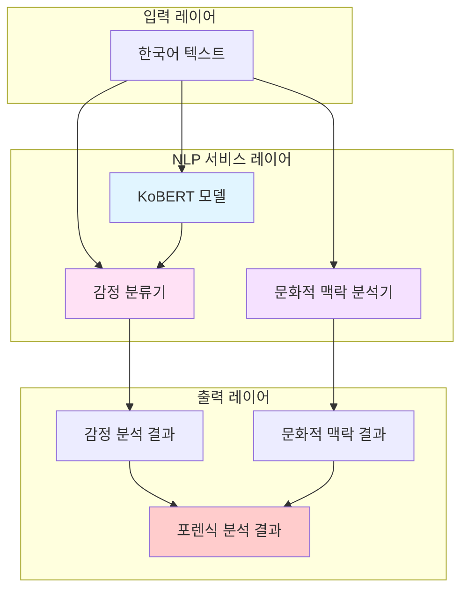
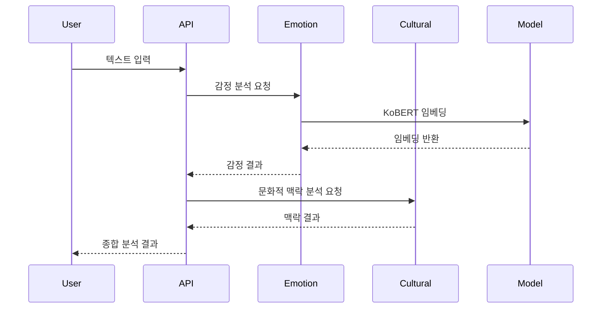

# NLP 서비스 아키텍처

## 개요

Voice Man NLP 서비스는 KoBERT (Korean BERT) 기반의 한국어 텍스트 분석 시스템으로, 감정 분류, 문화적 맥락 분석, 범죄 언어 패턴 탐지 기능을 제공합니다.

---

## 아키텍처 개요



---

## 모듈 구조

### 서비스 모듈 (`src/voice_man/services/nlp/`)

```
nlp/
├── __init__.py              # 모듈 초기화
├── kobert_model.py          # KoBERT 모델 래퍼 (336줄)
├── emotion_classifier.py    # 감정 분류기 (271줄)
└── cultural_analyzer.py     # 문화적 맥락 분석기 (402줄)
```

### 데이터 모델 (`src/voice_man/models/nlp/`)

```
nlp/
├── __init__.py              # 모델 초기화
├── emotion.py               # 감정 분류 데이터 모델 (50줄)
└── cultural.py              # 문화 분석 데이터 모델 (77줄)
```

---

## 핵심 컴포넌트

### 1. KoBERTModel

**목적**: KoBERT 모델 래퍼로 GPU/CPU 자동 감지 및 효율적 리소스 관리 제공

**주요 기능**:
- 싱글톤 패턴으로 효율적 리소스 관리
- GPU/CPU 자동 감지 및 장치 전환
- 배치 처리 지원
- GPU 메모리 모니터링
- 한국어 BERT 임베딩 추출

**사용 예시**:
```python
from voice_man.services.nlp.kobert_model import KoBERTModel

# 모델 초기화 (자동 GPU 감지)
model = KoBERTModel(device="auto")

# 텍스트 임베딩 추출
embeddings = model.get_embeddings("한국어 텍스트 분석")

# 배치 처리
results = model.encode_batch(["텍스트 1", "텍스트 2", "텍스트 3"])
```

### 2. KoBERTEmotionClassifier

**목적**: 7개 감정 카테고리 분류

**감정 카테고리**:
- happiness (행복)
- sadness (슬픔)
- anger (분노)
- fear (공포)
- disgust (혐오)
- surprise (놀람)
- neutral (중립)

**주요 기능**:
- 단일 텍스트 감정 분류
- 배치 감정 분류
- 신뢰도 점수 계산
- 불확실성 플래그

**사용 예시**:
```python
from voice_man.services.nlp.emotion_classifier import KoBERTEmotionClassifier

classifier = KoBERTEmotionClassifier()
result = classifier.classify("오늘 정말 기뻐요")

print(result.primary_emotion)  # 'happiness'
print(result.confidence)       # 0.85
print(result.emotion_scores)   # 모든 감정 점수
```

### 3. KoreanCulturalAnalyzer

**목적**: 한국어 문화적 맥락 분석

**주요 기능**:
- 존댓말/반말 분석
- 위계 관계 패턴 탐지
- 한국어 특유 조작 표현 패턴 탐지
- 종합 문화적 맥락 분석

**존댓말 패턴**:
- 입니다체: "입니다", "거든요"
- 해요체: "세요", "군요", "나요"
- 합쇼체: "답"

**반말 패턴**:
- 해체: "아", "어"
- 해라체: "야", "다", "니"

**위계 마커**:
- 가족: 할머니, 아버지, 누나, 형
- 직장: 사장님, 부장님, 과장님
- 사회: 선생님, 고객님, 회원님

**사용 예시**:
```python
from voice_man.services.nlp.cultural_analyzer import KoreanCulturalAnalyzer

analyzer = KoreanCulturalAnalyzer()

# 존댓말/반말 분석
speech = analyzer.analyze_speech_level("안녕하세요? 오늘 날씨 좋네요.")
print(speech.level)  # 'formal'

# 위계 관계 탐지
hierarchy = analyzer.detect_hierarchy_context("어머니, 오늘 밥 드셨어요?")
print(hierarchy.has_family_markers)  # True

# 조작 패턴 탐지
patterns = analyzer.detect_manipulation_patterns("네가 잘못했으니까 그래")
print(len(patterns))  # 1
print(patterns[0].category)  # 'gaslighting'
```

---

## 데이터 플로우



---

## 설정

### KoBERT 설정 파일 (`src/voice_man/config/kobert_config.yaml`)

```yaml
model:
  name: "skt/kobert-base-v1"
  fine_tuned_path: null
  device: "auto"

inference:
  batch_size: 8
  max_length: 128
  confidence_threshold: 0.7

emotion_classification:
  emotions:
    - happiness
    - sadness
    - anger
    - fear
    - disgust
    - surprise
    - neutral

cultural_analysis:
  speech_levels:
    - formal
    - informal
    - mixed

  hierarchy_markers:
    - job_titles
    - kinship
    - social
```

---

## 성능 특성

### GPU/CPU 자동 전환

- GPU 사용 가능 시 자동으로 GPU 사용
- GPU 사용 불가 시 자동으로 CPU 폴백
- 메모리 부족 시 경고 로그 출력

### 배치 처리

- 기본 배치 크기: 8
- 동적 배치 크기 조정 지원
- 메모리 효율적 처리

### 모니터링

- GPU 메모리 사용량 추적
- 추론 시간 측정
- 장치 정보 제공

---

## 의존성

### 필수 의존성

```toml
[project.dependencies]
torch = ">=2.0"
transformers = ">=4.36"
```

### 선택적 의존성 (GPU 가속)

```toml
# GPU 가속을 위한 CUDA 지원 PyTorch
# 별도 설치 필요: scripts/install-cuda-deps-py312.sh
torch = { source = "pytorch" }
```

---

## 향후 확장

### Phase 2: 하이브리드 분석

- ML + 키워드 매칭 결합
- 기존 CrimeLanguageAnalysisService와 통합
- Fine-tuning 파이프라인 구축

### Phase 3: 고급 기능

- Attention 기반 핵심 토큰 추출
- 설명 가능성 (Explainability) 강화
- 멀티턴 대화 맥락 분석

---

**문서 버전**: 1.0.0
**최종 업데이트**: 2026-01-11
**SPEC**: SPEC-NLP-KOBERT-001
