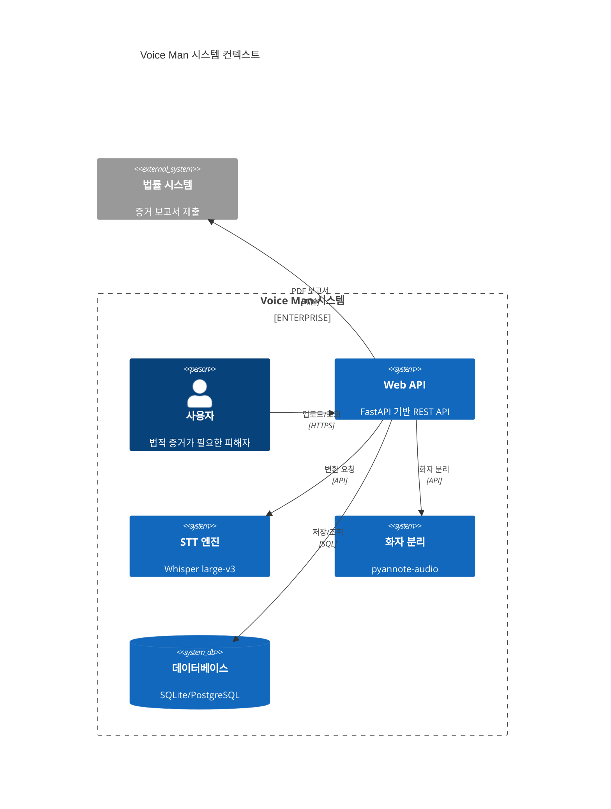
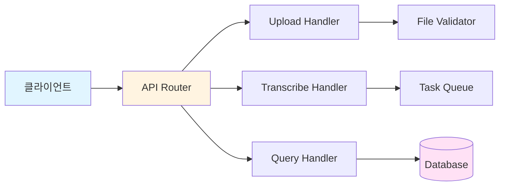
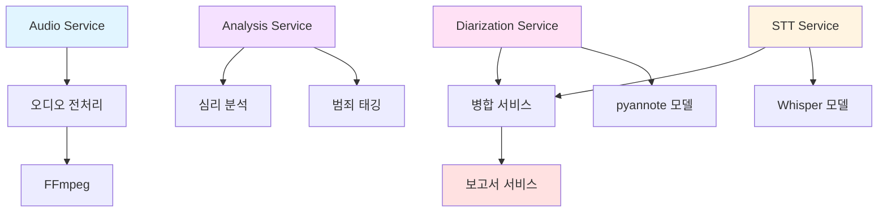
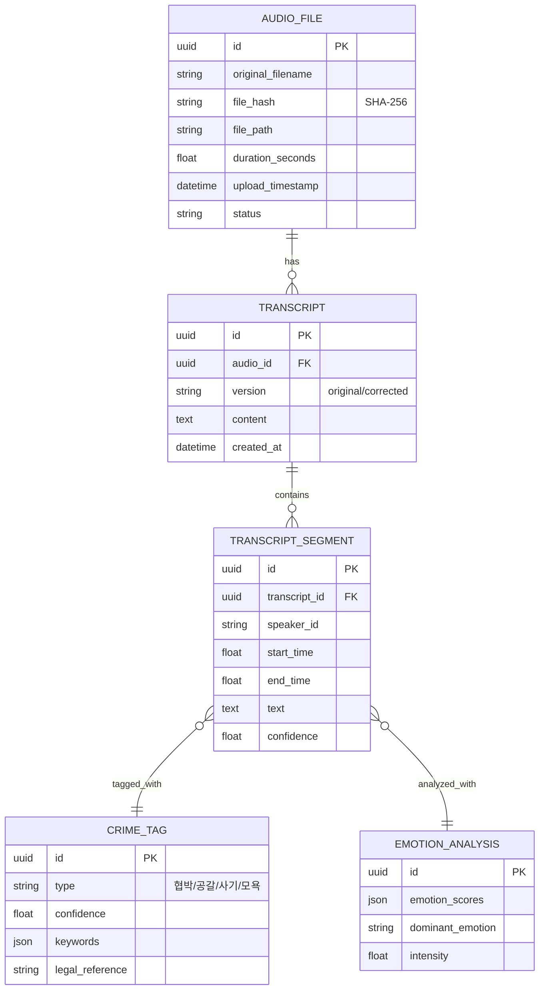
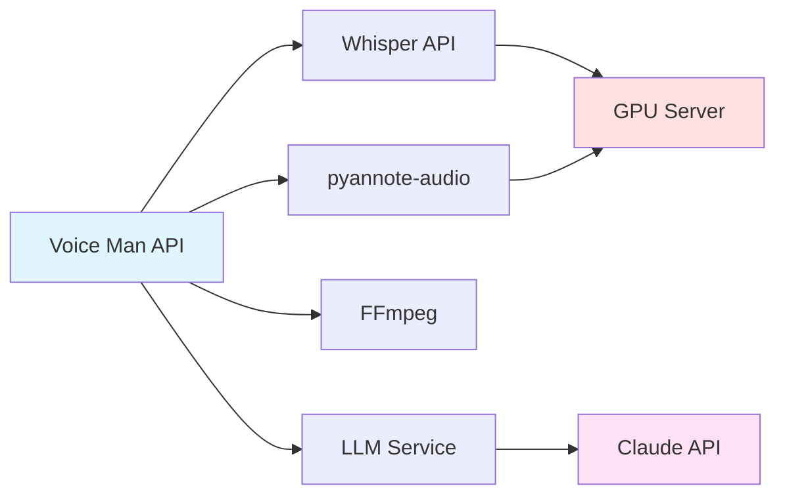
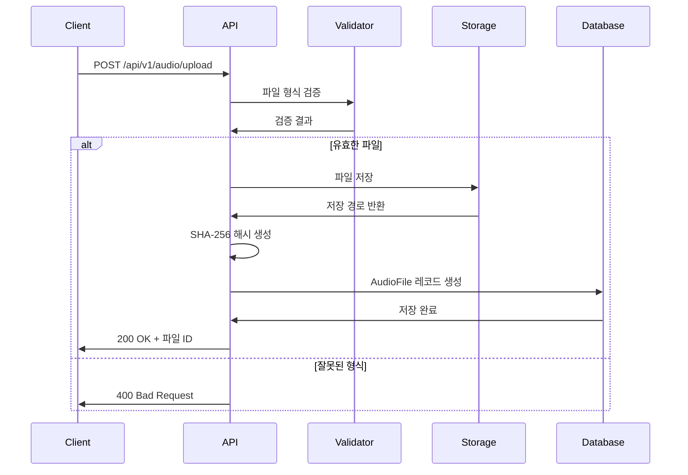
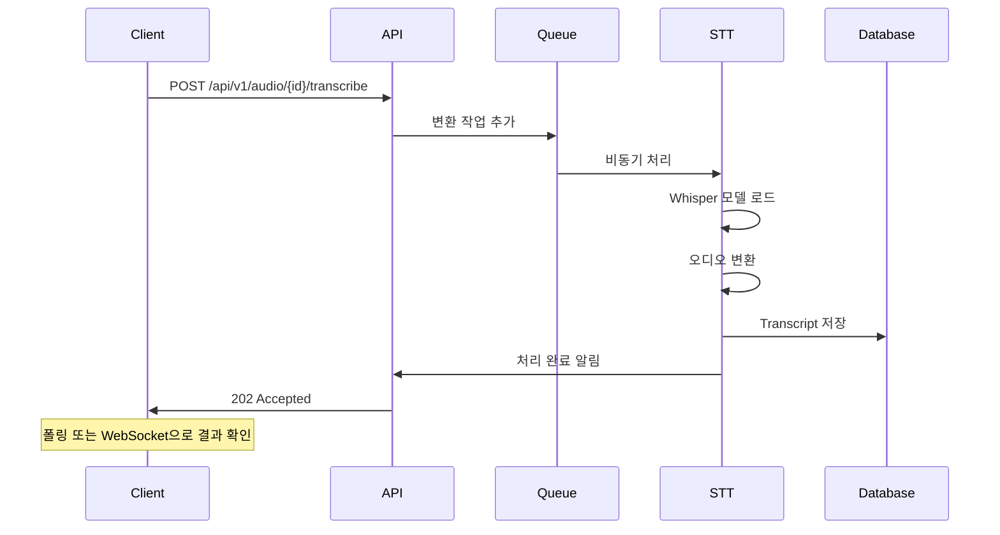
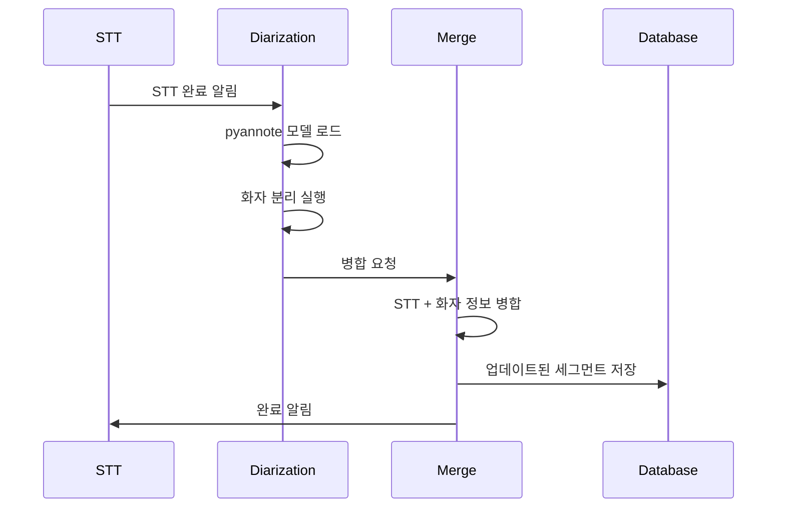
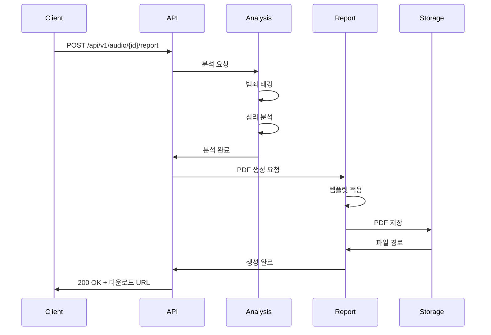
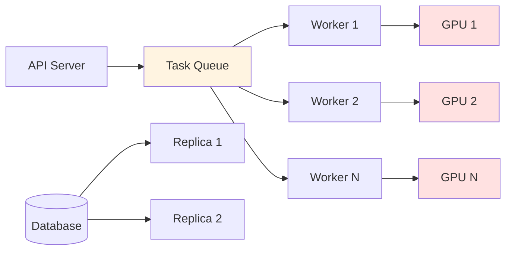

# 시스템 아키텍처

Voice Man 시스템의 전체 아키텍처와 구성 요소를 설명합니다.

## 전체 시스템 구조

## 핵심 컴포넌트

### 1. API 계층

FastAPI 기반의 REST API 계층입니다.

**구성 요소**:
- **API Router**: 요청 라우팅 및 미들웨어
- **Handlers**: 각 엔드포인트별 비즈니스 로직
- **Validators**: 입력 데이터 검증
- **Response Models**: 표준화된 응답 형식

### 2. 서비스 계층

비즈니스 로직을 처리하는 서비스 계층입니다.

**서비스 목록**:

#### 오디오 서비스 (AudioService)
- 파일 형식 검증
- SHA-256 해시 생성
- FFmpeg 전처리 연동
- 메타데이터 추출

#### STT 서비스 (STTService)
- Whisper 모델 로드
- 비동기 변환 처리
- 세그먼트별 타임스탬프 추출
- 신뢰도 점수 산출

#### 화자 분리 서비스 (DiarizationService)
- pyannote-audio 모델 로드
- 화자 구분 및 레이블링
- STT 결과와 병합
- 화자 통계 생성

#### 분석 서비스 (AnalysisService)
- 범죄 발언 태깅
- 가스라이팅 패턴 감지
- 감정 분석
- 위험도 평가

#### 보고서 서비스 (ReportService)
- PDF 보고서 생성
- 분석 결과 통합
- 템플릿 관리

### 3. 데이터 계층

데이터 영속성을 담당하는 계층입니다.

### 4. 외부 연동

## 데이터 흐름

### 1. 파일 업로드 흐름

### 2. STT 변환 흐름

### 3. 화자 분리 흐름

### 4. 분석 및 보고서 흐름

## 비기능적 요구사항

### 성능

| 항목 | 목표 | 측정 방법 |
|------|------|-----------|
| STT 변환 속도 | 실시간 대비 0.5x 이하 | 5분 파일 → 2.5분 이내 |
| API 응답 시간 (조회) | P95 < 2초 | 로그 분석 |
| API 응답 시간 (분석) | P95 < 5초 | 로그 분석 |
| 동시 처리 수 | 10개 파일 | 부하 테스트 |

### 보안

| 항목 | 구현 방법 |
|------|-----------|
| 원본 보존 | 불변(immutable) 저장소 |
| 데이터 암호화 | AES-256 at-rest |
| 전송 보안 | TLS 1.3 |
| 접근 제어 | JWT 인증 |
| 감사 로그 | 모든 요청/변경 기록 |

### 확장성

**확장 전략**:
- **수평 확장**: API 서버 다중화
- **비동기 처리**: Task Queue 기반 워커 확장
- **GPU 풀링**: GPU 리소스 공유
- **데이터베이스 복제**: 읽기 부하 분산

### 가용성

| 항목 | 목표 | 구현 방법 |
|------|------|-----------|
| 시스템 가용성 | 99.5% | 이중화 구성 |
| 데이터 내구성 | 99.99% | 다중 백업 |
| 재해 복구 | RPO < 1시간 | 백업 전략 |
| 장애 조치 | 자동 복구 | 헬스체크 및 재시작 |

## 기술 의사결정

### 왜 FastAPI인가?

1. **비동기 처리**: asyncio 기반 고성능
2. **자동 문서화**: OpenAPI/Swagger 자동 생성
3. **타입 검증**: Pydantic 기반 강력한 타입 체크
4. **현대적**: 최신 Python 기능 활용

### 왜 Whisper인가?

1. **정확도**: WER < 10% (한국어)
2. **오픈 소스**: 무료商用 사용 가능
3. **다국어**: 한국어/영어 동시 지원
4. **커뮤니티**: 활발한 개발 및 지원

### 왜 pyannote-audio인가?

1. **정확도**: DER < 15%
2. **사전 학습**: 바로 사용 가능한 모델
3. **Python 네이티브**: 쉬운 통합
4. **연구 기반**: 최신 연구 성과 반영

### 왜 SQLAlchemy인가?

1. **ORM 강력**: 복잡한 쿼리 지원
2. **비동기 지원**: async/await 패러다임
3. **데이터베이스 독립**: SQLite ↔ PostgreSQL 마이그레이션 용이
4. **마이그레이션**: Alembic과 연동

---

**관련 문서**:
- [API 레퍼런스](api-reference.md)
- [배포 가이드](deployment.md)
- [개발 가이드](development.md)
