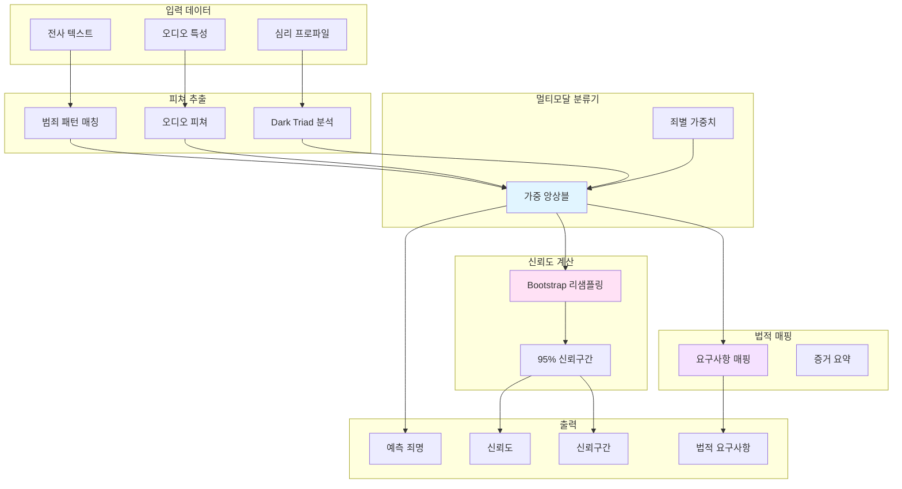
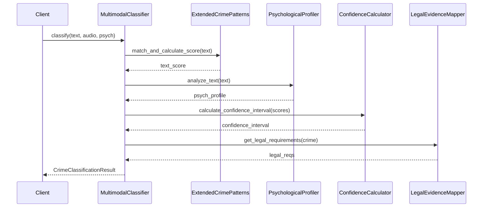
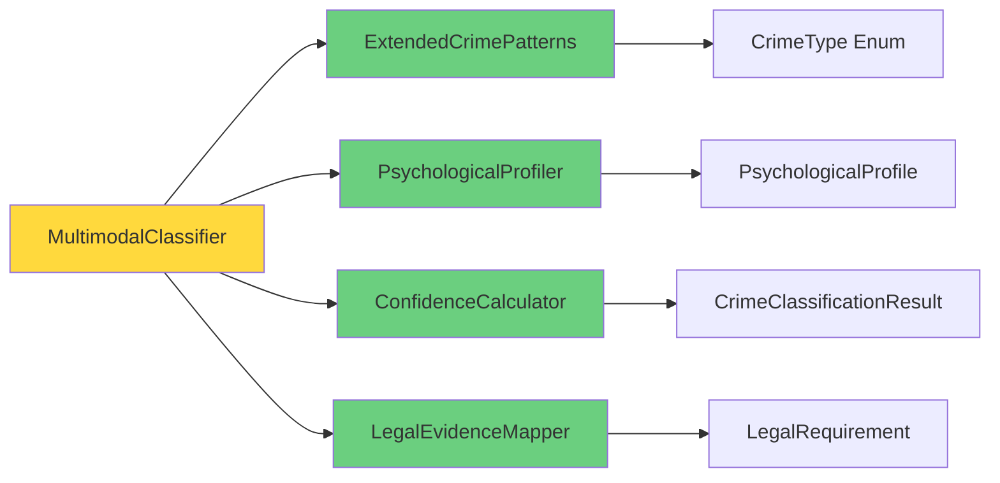

# 범죄 분류 시스템 아키텍처

## 시스템 구조



## 데이터 모델

### CrimeClassificationResult

```python
@dataclass
class CrimeClassificationResult:
    primary_crime: CrimeType  # 예측 죄명
    confidence: float  # 신뢰도 (0-1)
    modality_scores: Dict[CrimeType, ModalityScore]  # 모달별 점수
    confidence_interval: Dict[str, float]  # 95% 신뢰구간
    legal_requirements: Optional[LegalRequirement]  # 법적 요구사항
    psychological_profile: Optional[PsychologicalProfile]  # 심리 프로파일
```

## 서비스 상호작용



## 파일 구조

```
src/voice_man/
├── models/crime_classification/
│   ├── crime_types.py           # 죄명 열거형
│   ├── classification_result.py # 결과 데이터 모델
│   ├── legal_requirements.py    # 법적 요구사항
│   └── psychological_profile.py # 심리 프로파일
│
└── services/crime_classification/
    ├── extended_crime_patterns.py      # 범죄 패턴 DB (240+ 패턴)
    ├── psychological_profiler.py       # Dark Triad 분석
    ├── confidence_calculator.py        # 신뢰구간 계산
    ├── legal_evidence_mapper.py        # 법적 매핑
    └── multimodal_classifier.py        # 멀티모달 분류
```

## 의존성


